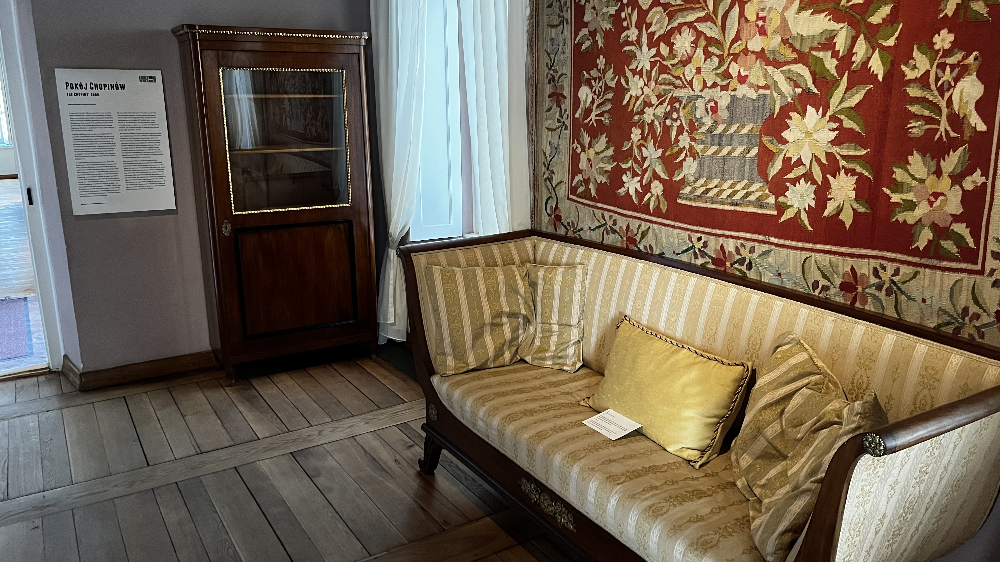
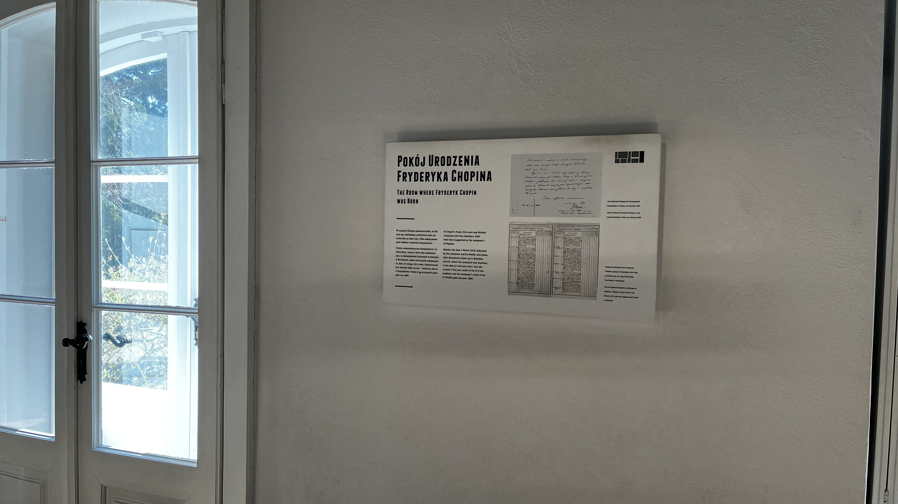
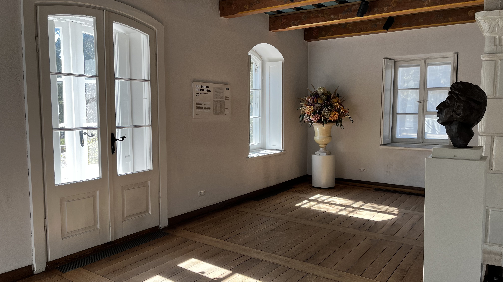
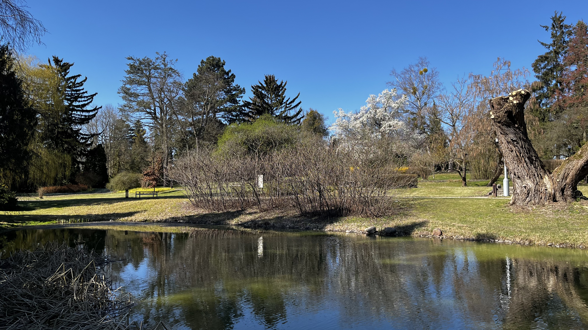

這次歐洲行的主要目的之一就是朝聖蕭邦故居，還沒來的時候對這邊的想像是一棟別墅，旁邊有售票亭、小花園之類的，不是一個很大的園區，實際到了現場才發現跟想像中的非常不一樣，比想像中大非常多，天氣好的話在裡面走走逛逛一兩個小時沒什麼問題。

### 交通攻略

我們是從華沙市區出發來到蕭邦故居的，這邊距離華沙市區其實不算特別近，從市區出發到蕭邦故居差不多要一個半小時（包含等車時間的話），故居就是在一個鄉下的悠閒地方。

交通的大致邏輯是先搭火車到 Sochaczew 車站，波蘭文聽起像是「索哈切夫」，到了之後再搭 42 號公車到 Żelazowa Wola 站下車走個沒幾分鐘就到了，主要會卡時間的是這個 42 號公車，一小時只有一班車，去程回程都是這樣，非常無情。

搭火車也不是一件容易的事情，人生地不熟而且中央車站有非常多上下車的地方，我在去程的時候是搭了要在 Warsaw Downtown 站上車的火車，跟從 Kraków 搭車來下車的車站是不一樣的地方，也有一小段距離，Warsaw Downtown 那邊周遭是一片綠地，車站也看起來比較舊一些，我猜就是一個華沙市中心的小站？要記得 Sochaczew 這個站名，那時候我們雖然已經到了但卻不確定搭車的地方是不是對的，就看著車站入口上面的大看板寫著這邊有出發往哪些地方的站名，還真的就有 Sochaczew。

因為太晚從 airbnb 出發的關係，到了車站的時候已經幾乎要遲到了，我們還在用線上刷卡加值 Jakdojade 不然裡面沒波蘭幣了，也就因為差這一點點時間，非常不幸的我朋友在買票的前一刻買票系統就鎖了起來，在火車進站的同時鎖起來，那時也沒想那麼多，就覺得買下一班車的車票給驗票人員看應該就有機會讓他放我們一馬，因為也看得到買票時間其實也就差一分鐘而已。但真的到了驗票的時候驗票員一臉無情說可以把這張票退掉了，一邊拿出刷卡機要我們補票，就算我們晚一分鐘買票而已也要罰錢，而且還罰不少，罰了 166 波幣左右，我們也是只能付錢了事，真的太菜了，之後買火車票真的是要提早一點買，否則驗票員看到搞不清楚狀況的外國人還不罰錢嗎（亞洲面孔在波蘭真的是非常明顯的外國人）。

> 事後想了一下當下那一站出發的票沒買到還有個耍小聰明的機會，就是在車上買下一站出發的車票（剛好 Warsaw Downtown 到下一站只有一下下而已不會馬上被驗票），因為從下一站出發的票在到站之前一定還是可以買的，不過也是說說而已，不鼓勵這種不誠實的行為，提早儲值買票才是最正確的選擇

下火車之後在右前方會看到一個自動售票機，請往這個售票機走但忽略這個售票機，繼續往前走個幾步路之後右轉，大約 20 公尺處就會有一個公車站牌，上面只會有一個路線的公車時刻表，就是這個 42 號的神奇路線時刻表。到了快要發車的前 20 分鐘之類的公車司機大概就會在這邊等了，司機會售票，每人每趟 4 波幣，只能現金付款所以要先準備好波幣現金。基本上司機不太會講英文，但他也知道來這邊的外國人也只能是來看蕭邦故居的，所以就比手畫腳一下，關鍵字 Chopin 有說到就能確認沒什麼問題了。要在 Żelazowa Wola 站下車（波蘭文聽起來像「熱拉佐瓦 沃拉」），下車前按按鈕，到了之後走個一下就可以看到這篇文封面圖的蕭邦故居大門了。

到了記得看一下回程的公車班次，先有個心理準備大概要離開的時間，免得錯過了又要多等下一班一小時後的公車。

> 公車班次也可以看 Google maps，印象中上面的班次時間都是對的，只要搜尋 Dom Urodzenia Fryderyka Chopina 就可以了（在上面搜尋蕭邦故居好像搜不到），如果想保險一點的話可以看公車站牌上面的時刻表，應該會更準

去的時候因為參考了網路上的資料寫說有個售票亭，司機不賣車票，所以就在車站前的售票機買了來回票（因為網路上文章也說在故居沒有賣回程票的），於是就半信半疑的一人買了兩張 2.5 波幣的公車票（有點懷疑是因為網路上的文章也說一趟是 4 波幣），這之中肯定是有什麼問題，真真假假虛虛實實，最後上了車司機跟我們說要買票才知道，原來是售票方式有更新了，兩張來回的 5 波幣公車票就算了吧，當作付學費。

> 我們也有問 42 號公車的司機那個售票機的票能不能用，他跟我們解釋說是大的那種公車才能用那種票，像他這種特殊路線的小公車是不能用的\
> 順帶一提司機說 bus 的時候是說「簿斯」，用波蘭文的方式發音英文我覺得聽起來很可愛

### 故居

一到故居就會看到一個很像博物館的地方，其實是售票亭還有紀念品販售區。入場門票有分只有花園和花園+故居，既然都到了就都要看吧，一共是 30 波幣，我覺得蠻便宜的，並且剛好我去的時候天氣非常好，也陸陸續續有一點花開了，漫步在幾乎沒什麼人的大花園裡面著實是遠離塵世的安靜時刻。

> 行前做功課的時候本來是禮拜三免費，我們去的時候好像剛好改成禮拜一（禮拜一原先是放假的）

在走出售票亭的同時就會聽到微弱的音樂聲，是蕭邦的曲子（剛好在播幻想波蘭），最一開始我還以為是今天運氣非常好有免費的戶外現場演奏可以聽，再繼續往前多走幾步之後就會發現這個音樂是圍繞著你的，走到哪就跟到哪，到步道邊邊仔細一看才發現原來每隔幾公尺的距離就有一個綠色的 BOSE 喇叭，播著蕭邦的音樂，雖然沒有免費的戶外現場音樂會可以聽有點失望，但走著走著有一種莫名的感動，播的都是非常熟悉的曲子，就像是有來過一樣的感覺，然而卻是在一個第一次去的國家、第一次參觀的故居大花園，應該可以算是本次歐洲行裡面最讓人印象深刻的感動時刻之一，也算是完成了一個蕭邦粉的 check list。

在道路的左邊有一個電影院，播放著跟蕭邦出生故事有關的影片，進去短暫了看了一下之後就出來往故居小屋走了，走著走著都有蕭邦的音樂相伴，搭配著涼爽舒適的天氣，非常愜意。在小屋的門口有驗票員阿嬤，我們在外面的花園閒逛的時候他時不時還會走出來晃晃。進去小屋之後裡面有一些相關的文字說明，包含了蕭邦爸媽如何在這邊認識並且生下蕭邦，也介紹了這一大片公園因為戰亂的關係幾乎都被破壞掉了，只留下了這個小屋（我看英文解說的理解是這樣...）。小屋其實並不算特別大，主要是感受一下氛圍，裡面沒有蕭邦音樂、安安靜靜的，很適合慢慢閱讀牆上的導覽資訊，一邊閱讀一邊有種「哇，原來蕭邦之前在這邊生活過啊」的感觸。

在離開故居小屋之後繼續往更深的地方走的話就再也不會有蕭邦的音樂了，沿路有花花草草、水池，還有一個小河川。這次去歐洲看到蠻多地方都有長得蠻像的白花盛開在樹上，我覺得非常漂亮，應該可以說是這次去歐洲最印象深刻並且喜歡的一種花木了（雖然不太確定我看到的是不是都是一樣的品種）。

> 仔細看地圖上會有一個「海洋之眼（Morskie Oko）」，剛好這次去波蘭也有去 Zakopane 的海洋之眼，所以非常好奇蕭邦故居的海洋之眼長怎樣\
> 才發現名稱非常壯觀但實際上其實只是一個小水坑，就不把照片放上來了...

#### 故居內部

#### 花園

### 回程

準備要回程的時候剛好趕不上一小時一班的公車，所以就繼續多待了一個小時。真的要離開的時候順便去看了一下售票處旁邊的紀念品商店，結果發現跟市區裡蕭邦博物館賣的東西有九成像，本來還蠻期待這邊有獨家紀念品的...，有點小失望。

因為擔心又被罰錢所以在車上就提早買好回程的火車票了，這次改買 IC 開頭的（這班車就沒有站站停了，比早上的火車還快抵達目的地），結果誤點了有點久，就去對面買了一下 kebab（類似沙威瑪的卷餅），其實蠻好吃的而且價格不貴，又蠻大份的。應該是因為我們是亞洲面孔，所以老闆有跟我們用英文很勉強的聊了一下（我覺得非常勉強），老闆們都是孟加拉人，然後也都會講波蘭文，不過口音真的偏重，不管英文還是波蘭文都是，下次還有機會的話應該會一下火車就去買來吃，畢竟開在火車站對面還能有這個價格實屬不容易的一件事情。

### References

* [[波蘭] 漫步波蘭鄉間，尋找蕭邦故居](https://weronikapoland.wordpress.com/2015/06/10/%E6%B3%A2%E8%98%AD-%E6%BC%AB%E6%AD%A5%E6%B3%A2%E8%98%AD%E9%84%89%E9%96%93%EF%BC%8C%E5%B0%8B%E6%89%BE%E8%95%AD%E9%82%A6%E6%95%85%E5%B1%85/)