在[朝聖蕭邦故居](/p/2025-euro-trip-1/)之外，也安排了一些波蘭南部的行程，不得不說波蘭真的非常大，這次去只有玩到三個城市（或者應該說歐洲國家都這麼大），感覺還有很多沒有玩到、沒有體驗到的，而其中一個行程就是在 Zakopane（這個地名的唸法就蠻直覺的，跟翻譯「札科帕內」很接近），原本預計是爬山健行加上看個海洋之眼而已，殊不知到了現場之後變成冰天雪地的行軍，是對體能以及意志力的一大考驗...。雖然一邊跑一邊走下山的時候快累死了（怕趕不上火車），但還是非常值得的一個體驗。

### 行前提醒

1. 我們去的時候是春天，因為可能會遇到下雪所以我穿的是防水的靴子，與我同行的朋友只是穿一般的運動鞋也沒有防水，相比起來應該會比較不舒服（但運動鞋走起來也比較輕），那些下雪登山所需的裝備在這邊就不一一贅述了
2. 在上山之前記得要先換現金，山上的所有東西都不能刷卡（包含馬車、食物、公車車票）
3. 可以帶食物、水壺上山或是直接在山上的商店買（水壺可以用來裝山泉水來喝，不知道這樣好不好但我是有喝就是了）

### 交通與住宿

我們的上一個行程在 Kraków，還算不會太遠，因此選擇的是 FlixBus 直接從 Kraków 火車站在晚上六點四十出發，到了 Zakopane 已經是晚上九點了，車程大約二小時多。Kraków 火車站有幾個地方都可以搭 FlixBus，第一時間我們也找不太到要在哪邊搭車才對，是直接拿上網買票之後印出的紙本票去問站務人員，才知道是在二樓搭，建議大家可以提早一點時間去才不會匆匆忙忙的搭車。這次選擇 FlixBus 也是為了能多體驗一種交通工具，我覺得 FlixBus 體驗下來還不錯，票價並不貴然後也沒什麼不舒服的地方。

在到了 Zakopane 之後就搭公車去住宿，大概因為是從火車站出發的關係所以公車不會等太久，印象中那時候才錯過了一班，下一班只要十幾分鐘左右。那時候在挑選住宿的時候發現其實選擇蠻多的，蠻多民宿的，也有飯店，特別是離滑雪場特別近的地方有很多可以住的，但我們這次沒有要滑雪因此可以不考慮那些。下了公車站之後其實還蠻荒涼的，路上的路燈不多，除了少數幾間照明很充足的飯店/民宿之外就是一個鄉下地方的感覺（有可能是出於環境保護減低光害），到了民宿的時候要找招牌其實不太容易，也多虧了我們對面有一間超大度假村，周遭就他最亮、最大間，也提供了一點照明。這間民宿的設備還不錯，感覺算是新的，東西不會有舊舊的感覺，不過有點有趣的是他的浴室是看似有乾濕分離，實際上卻有可能大淹水，因為從排水的地方到浴室，一直到房間地板都是沒有門檻的，我洗到一半才發現水已經快跑到房間裡了，只好把水關起來讓他先排水一下。至於早餐的話我覺得也不錯，是小型的自助式早餐，該有的都有，不過就是歐洲的那些食物（火腿、起司、麵包那類的），還是沒有吃得很習慣，就當作一個體驗囉。

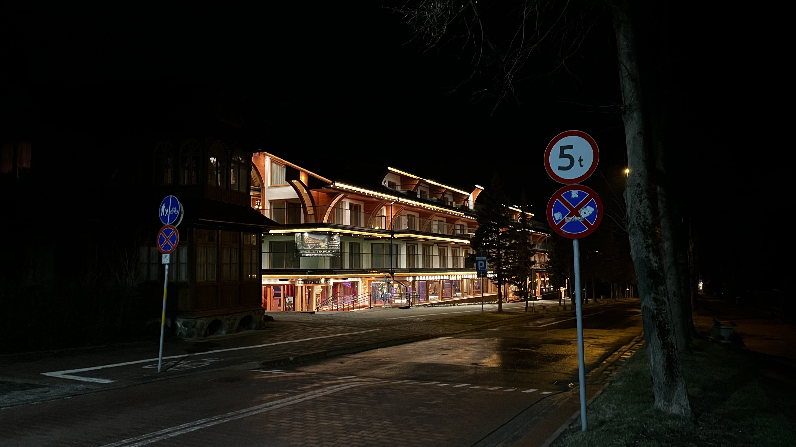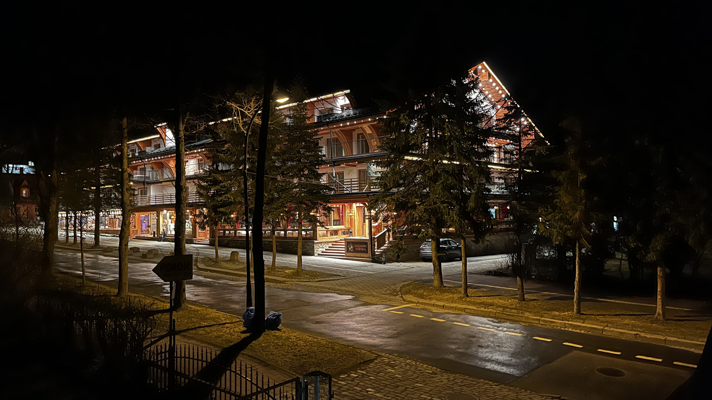

關於天氣的話，晚上一到 Zakopane 的當下氣溫大概 5 度上下，隔天早上就變得更冷了，會到 2 度左右，在看氣象預報的時候非常期待到底會不會看到雪呢，如果真的下雪的話，我人生第一次看到雪就是在這了。

海洋之眼在山上，需要在火車站搭一班特別的巴士（海洋之眼專車）才能抵達，單趟大約一小時的時間，並且單趟票價是 15 波蘭幣。大概算了一下時間：我們要從 Zakopane 離開的火車 17:32 發車，從山上必須搭 16:00 的專車下山才來得及，然後出於沒有要太早起的緣故所以最後決定在 9:00 搭專車上山。

> 大重點：要記得換波蘭幣現金

### 海洋之眼

吃完早餐之後我們就移動到火車站，並把行李寄放在車站去搭專車，專車我們也是東問西問了一下才知道搭車地點是在 1 號乘車月台，專車的前擋風玻璃會有一張牌子寫說到海洋之眼（Morskie Oko），理論上不會太難問到/找到，因為大部分人到了 Zakopane 應該都會上山看看，算是一個必去的景點。發車後到了一個公車站之後就停下來，司機請我們下車換搭另外一台車（不太確定原因是什麼），總之換了那台車之後繼續開呀開，開一小段時間之後往窗外一看就真的看到積雪了！看到的時候是難以言喻的感動，沒想到運氣真的這麼好，還以為四月初到這種地方不會有雪可以看，結果山上還真的下雪，非常幸運。到了之後會在一個停車場停下來（租車來玩的話會更方便一點，只是開車也比較累），下車之後就可以看到國家公園的售票亭了，票價我沒有印象有掏錢出來，但是網路上都寫要 8 波蘭幣，總之要帶足夠多的現金才不會搞烏龍。

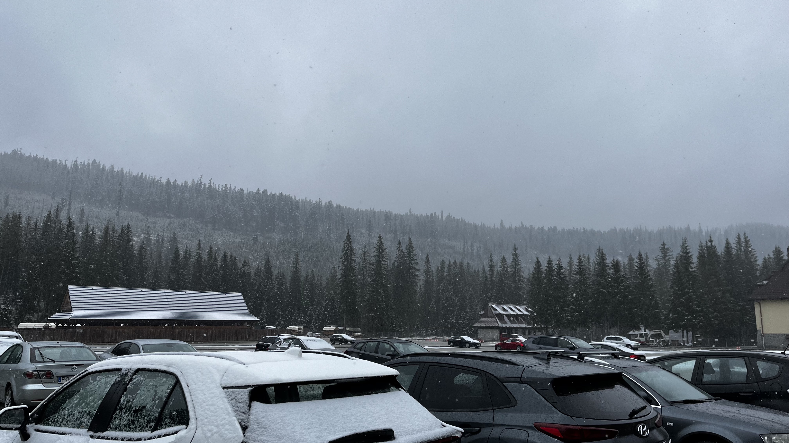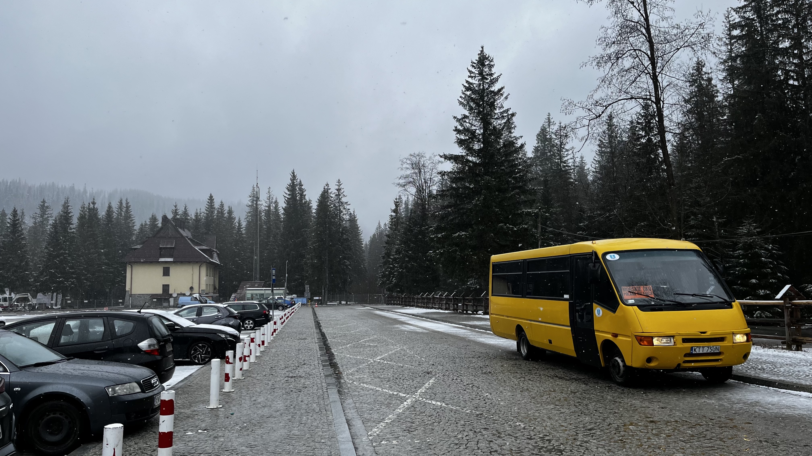

經過售票亭之後就可以看到馬車了，如果想要體驗課金行程的話要帶夠現金，單趟好像要 100 波蘭幣，我們現金不夠是沒辦法搭馬車的，不過現金就算夠應該也不會選擇馬車就是了，本來就打算要用走的走上山，一開始走的時候還沒什麼下雪，越是往山裡面走就有開始飄雪了，以坡度來說不會太陡，中間也有一些可以走捷徑的石子階梯，因為下雪的關係我走那些階梯是走得很小心，很怕一不小心就滑倒摔爛了。

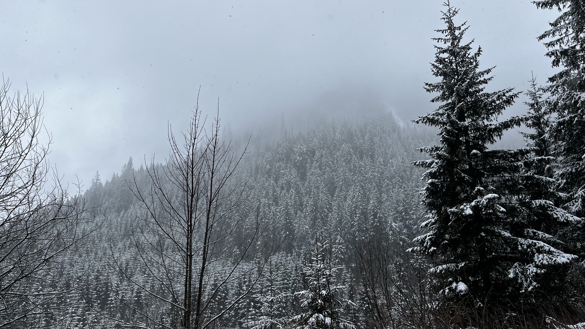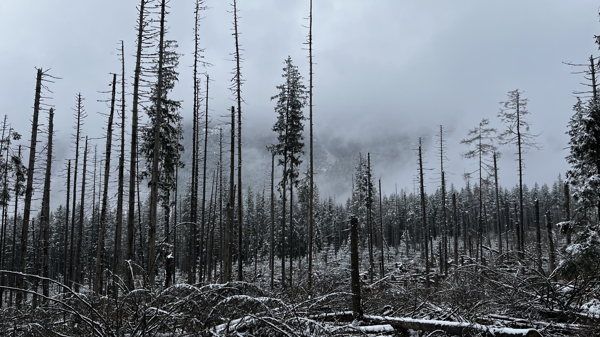

走一段時間之後，會經過一個很小的商店（沒賣什麼東西），繼續走就會遇到一個比較大的像是休息站的地方，我們買了一些食物來吃，爬完那一大段路之後有食物可以吃實在是非常幸福，也買了一杯咖啡來喝（外帶咖啡之後在外面沒過多久就涼掉了），就這樣邊喝邊繼續往前走。第一次看到雪景當然是拼命地盯著看，可是看久了其實會發現眼睛有點累，尤其是在進去室內的時候會發現有一小段時間幾乎看不太到，畢竟雪景很刺眼只是在看的時候不會一直都覺得不舒服。在抵達海洋之眼之前會遇到馬車的終點站，有幾輛馬車停在那邊不能再繼續往上了。

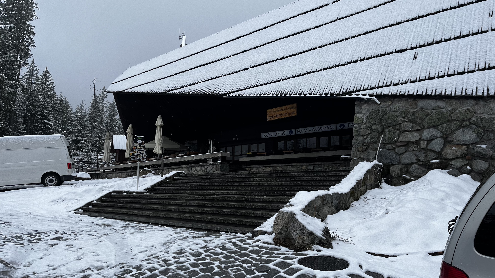

抵達海洋之眼之後又有一間商店，裡面賣的食物更多樣化，有正餐，也有海洋之眼的明信片可以買，比起前一個更像是一個全方位的觀光區餐廳，走到這如果時間有算好的話其實可以在這邊吃午餐，但我們因為時間不夠的關係所以就沒有什麼吃，我只點了一杯熱可可喝完就往外走，往下走一個階梯之後就可以看到結冰的海洋之眼了！

> 對照一下蕭邦故居的海洋之眼...

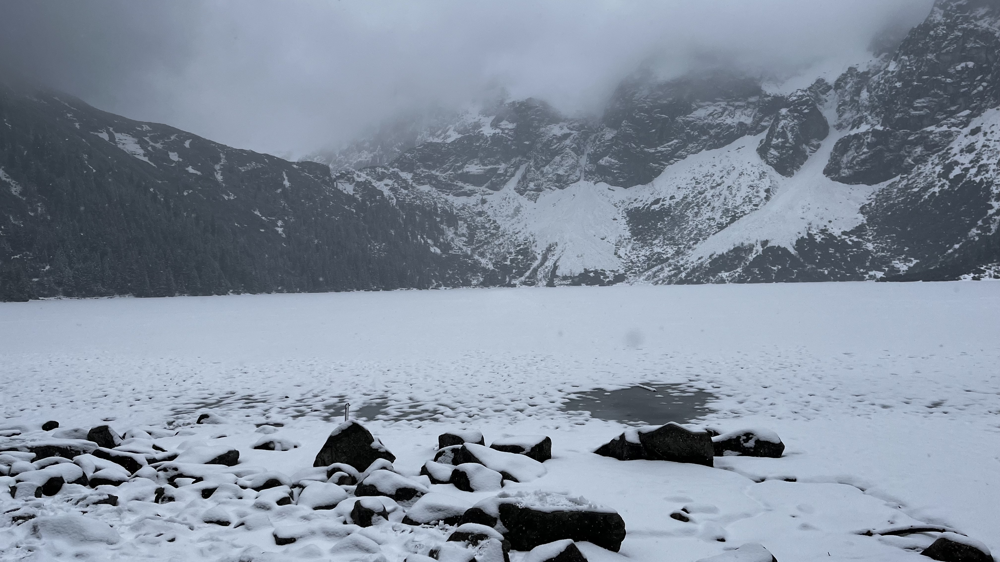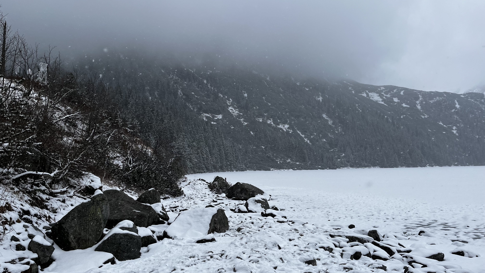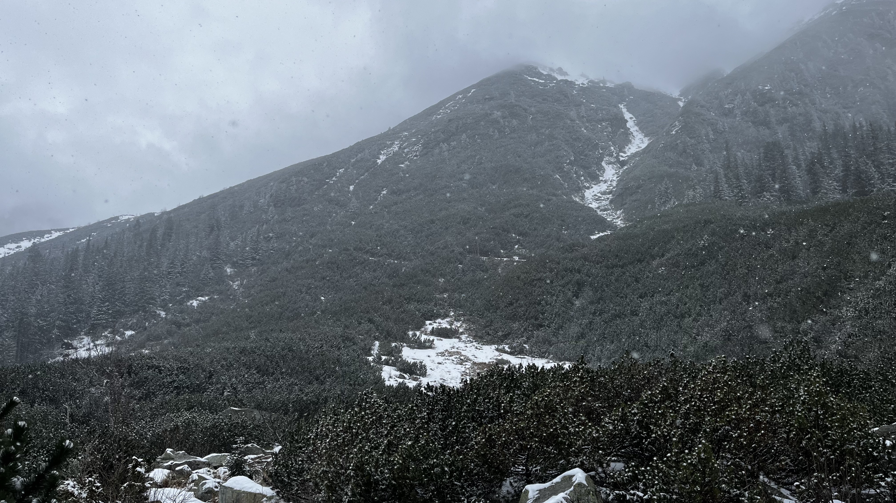

這時有個大膽的想法出現：是不是要繞完湖之後再下山，這時候我其實對時間完全沒概念（可能同行的朋友有大概算好），也沒有仔細看繞一圈需要多少時間加上下山所需的時間會不會來得及，於是就這樣開始挑戰了，沿路只在走五分鐘之後遇到一組外國人坐在結冰的湖邊看風景喝啤酒，之後就一個人都沒有遇到，說真的繞湖走一整圈在還有積雪的時候實在是有點危險，有蠻多需要上上下下的石頭，並且上面都覆蓋著雪或是已經正在融化的雪，有些地方甚至手也需要一起使用才比較好移動，感覺不小心滑下去就再見了，不死也半條命。於是就這麼一直走一直走一直走，在走的過程一直看著遠方的商店，一邊想著我們現在已經繞了百分之幾圈了一邊往前走（有時候甚至因為角度關係看不到商店），再加上根本沒有人在走這條路線，心情非常複雜：焦慮、熱血、興奮、疲累、後悔、...，還好終究是安全的走完回到商店。

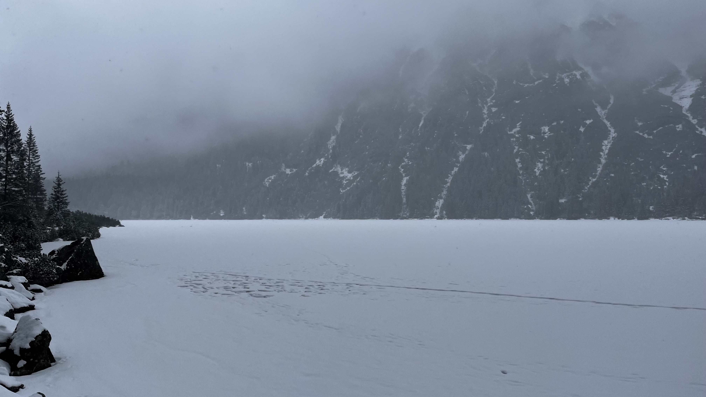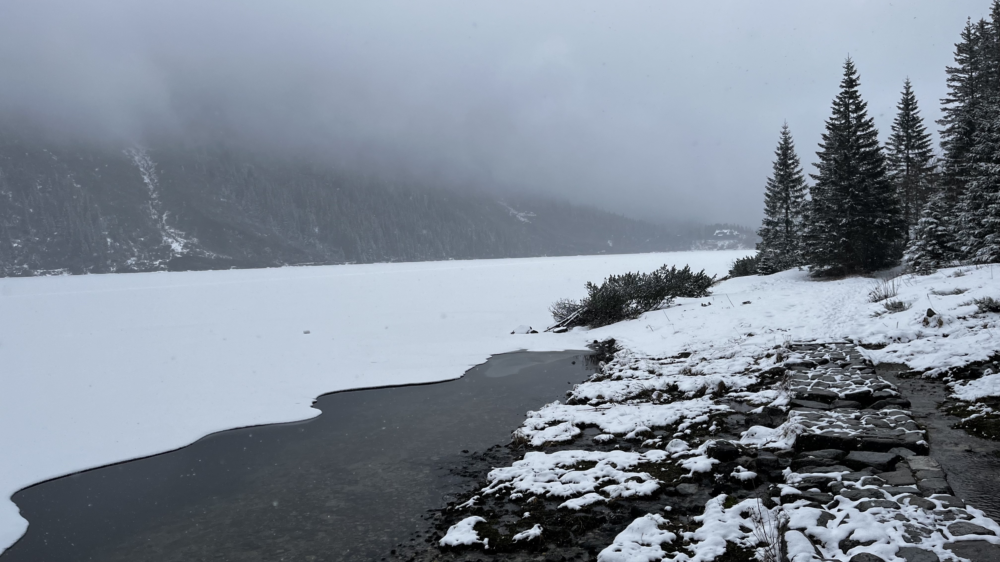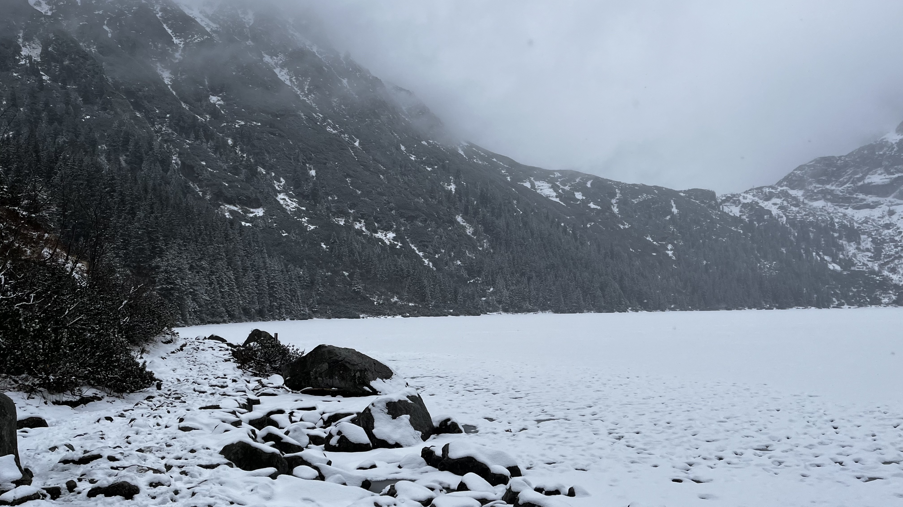

回到商店之後一看時間發現不妙，我們距離要搭公車的時間只剩不到兩個小時，打開 Google map 顯示抵達停車場的時間是在 16:14 之類的，表示不能用慢慢走的走下山了，一定要加快腳步不然會搭不上公車跟火車，用想的就覺得很可怕，於是就有了冰天雪地行軍的活動。先前情提要一下，我沒什麼爬山的經驗，同行友人比較有經驗，在上山的時候就已經明顯感覺到他輕鬆上山的速度我是會喘的，可想而知下山前就已經耗掉一定體力了，下山還需要加快腳步簡直是地獄級難度，我就跑一段走一段跑一段走一段，真的是拼了命的移動雙腳，沿路下山的過程發現蠻多積雪已經快融化完了，越往下走也就越沒有那麼多的雪景可以看了，地上也濕濕的，還好我有穿防水的靴子不然一定是濕爛，也非常佩服同行的專業登山客可以忍受鞋子又冰又濕這麼一大段時間。跑跑走走一段時間之後看到 Google map 的時間有所加快了，才越來越安心，最後總算是成功趕上下山的公車。在公車上是完全不想動，只想休息，也很感謝前兩個小時的自己，居然能夠完成這種極限挑戰。

### 總結

這一趟 Zakopane 一次體驗到了非常多以前沒體驗過的：
1. 下雪、賞雪、做雪球
2. 雪中登山（踩著一步一步積雪的登山）
3. 手腳並用翻越重重積雪難關
4. 行軍似的下山

這次因為時間不夠的關係所以沒辦法細細的體驗到 Zakopane 的城區，實在是有點可惜，不知道在節慶前後小城區裡的那些小木屋是不是會有漂亮的擺飾。希望下次可以在不同季節來這邊並且待久一點，Zakopane 的氛圍非常的舒適悠閒，很有親近大自然的感覺，又不會到非常荒涼，整體來說我非常推薦可以來這邊多玩幾天，就算不是排滿行程（像是我們這次）也會是一個很棒的度假地點。

最後感謝同行的專業登山客建議了這麼一個好地方，在做功課的時候本來沒有發現如此神秘的仙境。
