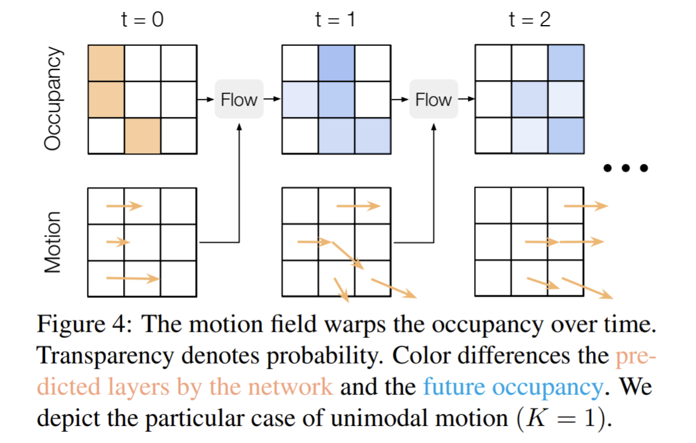

論文網址：\
[MP3: A Unified Model to Map, Perceive, Predict, and Plan](https://arxiv.org/abs/2101.06806)

### 概述

這一篇論文是關於自動駕駛的 model，和上一篇「玩命關頭」的不太一樣，這篇做的內容還包含了 planning 的部份，也就是規劃自駕車要如何行進。這個 work 是 Uber ATG（Advanced Technology Group）和多倫多大學的 work。這篇論文提出的方法優點大致上有以下幾個：
* 可以接受 high level 的指令（例如：左轉、右轉、直行）
* 不需要 HD Map
* 可解釋的 decision
* 更安全而且舒服的乘坐體驗

不得不說他們取名字的功力也是很強大，取了一個諧音梗作為 model 的名字。

### 前情提要

這個部份紀錄一下自駕車這個任務的一些重點：
* HD Map\
  HD Map 指的是能夠精準到**公分**等級的地圖，和我們一般直覺的線上地圖不是同一個等級的精準度。有一些自動駕駛的 model 會需要 HD Map 作為輸入，才能夠精準的駕駛（例如：開在正確的位置上，不能橫跨馬路的線）同時遵守交通規則（例如：有些紅綠燈要等左轉燈，有些則不用），給定一個目的地之後，只要有 HD Map，就可以準確的決定路線，可說是把任務的難度大大的降低了。但是問題在於 HD Map 的建置成本和維護的成本太高了，而且只要 HD Map 的資訊有一點點的誤差，就可以造成很嚴重的後果。本篇論文提出的方法是 Mapless 的方法，也就是不需要 HD Map（但論文還是假設一般的線上地圖是可以使用的）。
* 其他方法\
  大部份 Mapless 的方法都是朝著「模仿專家的開法」這個目標在努力。但是那些方法都沒有一個「可解釋的 intermediate representation」。特別是在這種牽涉到安全的應用上面，人們會比較在意「可解釋性」，來確保 model 不是學到了一個隨機的方法剛好 fit 在 dataset 上面。\
  也有其他方法是先把道路的分隔線取出來，但那些方法有些做了太強的假設，例如道路上的線是平行於車子的行進方向；或是有 information loss，例如 confidence thresholding（將 confidence 太低的 candidate 剔除，是在 detection 常用的作法），這麼做的最差情況就是得不到線的任何資訊，可能會造成嚴重的後果。\
  我自己覺得本篇論文的做法具有蠻強大的可解釋性，同時還有很不錯的表現是非常不容易的，因為就像是 hand-crafted feature 和 NN 的能力比起來，雖然 NN 比較難以被解釋，但是效果比可解釋的 hand-crafted feature 好的非常多。本篇論文也有使用 NN，但是並不是所有 component 都是 NN 所構成的。

### 內容

以下這個就是 model 的架構，這篇論文將整個 inference 的過程切成很多個小部份，位的就是得到一個 interpretable 的 model。

#### 從 point cloud 取 feature

這個部份是 follow [上一篇論文筆記](https://vincentthh35.csie.org/p/fast-and-furious-real-time-end-to-end-3d-detection-tracking-and-motion-forecasting-with-a-single-convolutional-net/)（速度與激情）的做法，以高度作為 channel，來避免 3D convolution 的 cost。

#### 可解釋的 representation

**Online Map**\
在算完 feature 之後，會把他們變成 online map：
* 車子可以開的地方
* 以目前行進方向可以開到的路（直行、左轉和右轉）
* 十字路口的區域（為了確保自駕車不要闖紅燈，另外這邊是假設已經知道 ground truth 的紅綠燈）

**Dynamic Occupancy Field**\
這個 representation 是要計算出在每一個時間點上，某一個方格點裡面有東西的機率是多少。因為其他 object detector based 的方法會使用到 confidence thresholding 和 non-maximum-supression，所以可能會把被判定低機率的 object 當作沒東西，造成潛在的危險。本篇論文提出的方法是將觀察到的 occupancy 加上一個算出來的 motion field（每一個物品的行進方向）來做出這個 dynamic occupancy field。作者還考慮到了不同 object 種類有不同的優先度（行人和單車列為比較優先的 object，撞到他們的後果遠比撞到車子嚴重）。在 motion field 的部份，因為每一個 object 都可能有一個以上的可能行進方向，所以作者使用了 $K=3$ 個 modal 來預測 object 的行進方向。

**Probabilistic Model**\
以上兩個 representation 作者都是用機率的模型來表示的。（例如：某個地方是不是「十字路口」是一個 Bernoulli random variable）

#### 決定車子要怎麼開

決定怎麼開的作法是從他們 collect 的 dataset 裡面 sample。先把所有 trajectory 以當下的「速度、加速度、轉彎角度」分類起來，在 inference 的時候就從裡面選一個 trajectory，並讓車子照著它的「加速度、轉彎角度的變化」來行進，不直接照抄 trajectory 的轉彎角度和速度的理由是從 dataset 裡面 sample 出來的 trajectory 的狀態可能和當下有些微的不同，所以不能直接照著用，而是要取它的加速度和轉彎角度變化，這樣的話才能有 continuous 的速度和方向。

至於開車的路線（什麼時候要轉彎），如果有 HD Map 的話就可以直接用 HD Map 上面的路線，如果沒有的話，就要像最上面那張圖一樣，給定一個直行、左轉或右轉的指令，這樣的 inference 其實很接近 GPS 導航的模式。綜合以上的結果之後，model 會輸出一個行進路線的 probabilty map。

最後就是要為產生的路線評分，實際的 loss function 就不一一列出了，在這邊列出幾個 component：
* 必須要和 ground truth 的行進路線越像越好
* 必須要開在馬路上
* 不能開在很可能有東西的位置上
* 不能亂加速、亂轉彎

#### Training

作者將 training 分成兩個階段，第一個階段先 train 好 online map、dynamic occupancy field 和理解 high level command 的 component。在第二階段就不動以上的東西，再訓練 planner（決定路線的 component）。

### 結果

簡單紀錄一下 baseline 的方法：
* Imitation Learning（IL）：只用 scene 當下的 context 來判斷
* Conditional Imitation Learning（CIL）：能接受指令的 IL
* Trajectory Classification（TC）：和 NMP 類似，但 trajectory 是用 probabilty distribution 表示
* Neural Motion Planner（NMP）：Planning、detection、prediction 一起做的 multi-task 架構
* Conditional Neural Motion Planner（CNMP）：能夠接受指令的 NMP，是作者自行拓展 NMP 的

Evaluation 的方式有兩種，一種是只給定一開始的模擬情況，要自駕車根據指令跑到目的地，稱為 closed-loop；另一種是給定 ground truth 開到一半的情況，要自駕車接續著開。以下這張圖上面是 closed-loop 的結果，可以看到幾乎是海虐了其他 baseline。表格的欄位代表的意義：
* Success：成功抵達目的地
* OffRoute：沒開在指定的路線上
* L2：開的路線和 ground truth 的平均 L2 距離
* Progress per event：開多久才會發生失誤
    * oncoming：逆向行駛
* Comfort：
    * jerk：不平滑的加速或踩煞車（看單位的因次可以猜出來）
    * lateral acceleration：煞車或踩油門過猛

這篇論文有很精美的圖和很詳細的 appendix 可以參考。
