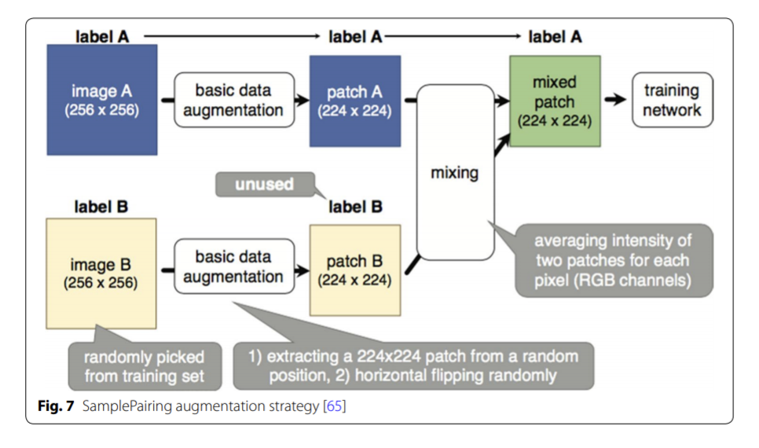
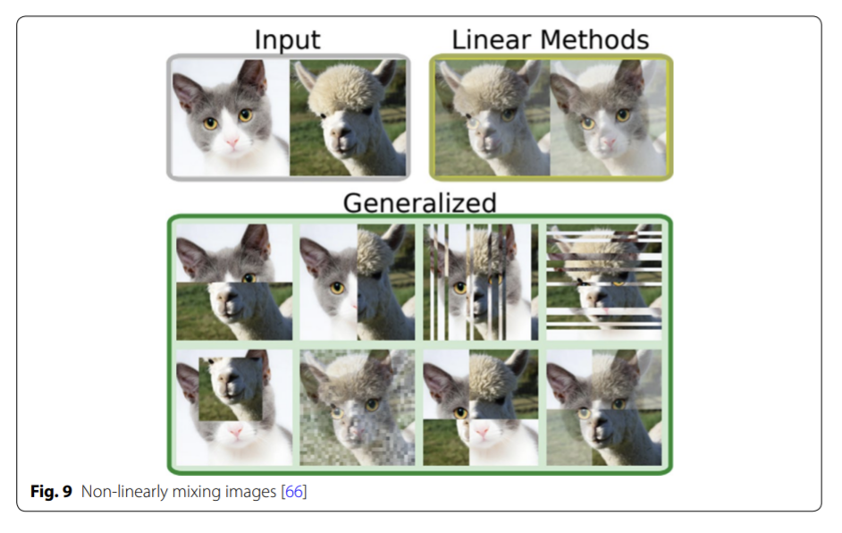
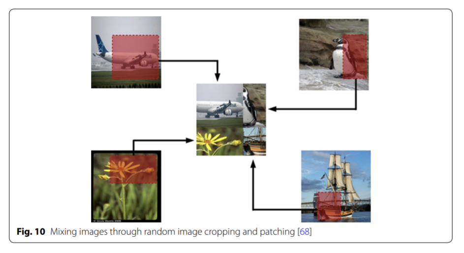
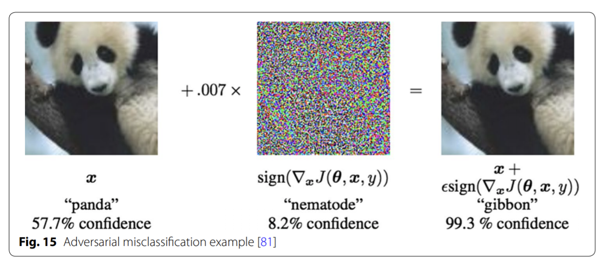
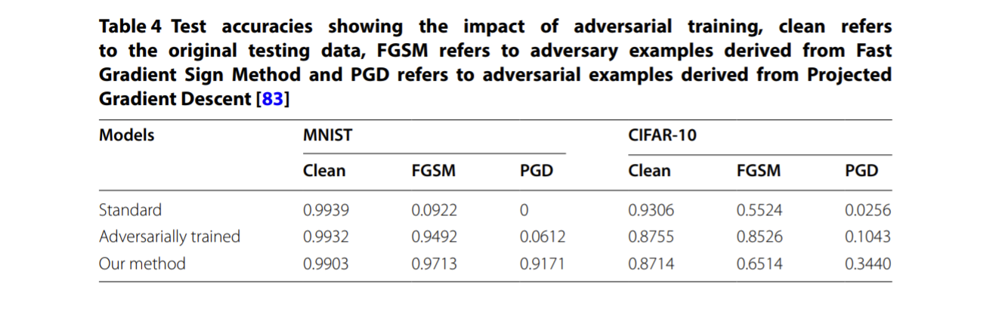
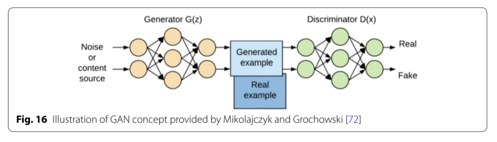

論文網址：\
[A survey on Image Data Augmentation for Deep Learning](https://journalofbigdata.springeropen.com/articles/10.1186/s40537-019-0197-0)\
（很長，總共48頁）

### 概述

這是一篇 survey paper，內容是在討論圖片方面的 data augmentation。隨著模型的複雜度增加，在訓練的時候就需要更大量的資料才能收斂，但大量資料的取得也是一個問題，所以 data augmentation 在訓練 model 的過程就變成了很重要的議題。這篇論文探討了 data augmentation 的各種面向，包含了目前大家所使用的 data augmentation 的各種方法以及相對應的效果、以及在使用 data augmentation 應該考慮的重點等等的。

### Image Data Augmentation 技巧

圖片的 data augmentation 技巧主要可以分為傳統方法和 deep learning based 的方法，以下先介紹傳統方法們（非 deep learning based 的方法）：

* geometric transformations
    * flipping
        * 將圖片水平或是上下翻轉
    * color space transformation（photometric transformations）
        * 對 RGB 操作、增加/減少亮度等等
        * 在「顏色不太重要」的 tasks 裡面比較能夠使用
    * cropping
        * 擷取圖片中特定大小的範圍
        * 會影響到圖片的 size
    * rotation
        * 旋轉
        * 對於某些特殊的 dataset，不能夠旋轉太大的角度（手寫數字轉太大的角度就會有不同的 label）
    * translation
        * 將圖片平移並將空白處填補特殊的 pixel（留白、高斯 noise 等等）
        * 不會影響到圖片的 size
        * 目的是為了使 model 也能夠對位於圖片中不同地方的 target 也能夠辨識的出來
    * noise injection
        * 加入 noise（高斯 noise 等等）

Geometric transformations 的好處在於，如果現有的測試資料的物件位置都在圖片的固定位置附近，則使用 geometric transformation 就可以有效的降低位置偏誤（positional bias），使得 model 不是固定去學圖片的某個地方而是看完整張圖片才作決定；並且這類的轉換相對比較簡單，有時候只需要多加幾行程式碼就能達成。然而它的壞處在於，有些 geometric transformation 在使用的時候需要人工檢查是否會將 label 弄亂，例如 數字 6 和 數字 9 是可以透過旋轉 180 度而得到的；並且在更複雜的應用上面，testing data 和 training data 並不是能靠普通的轉換得來的，因此 geometric transformation 還是有它的限制在。

* kernel filters
    * 使用特定的矩陣（kernel）去卷積，來達成特定的效果
    * 銳化、模糊化等等
    * 我個人認為相對比較不實用，因為這個在做的事情幾乎等同於一般的 convolution，與其自己設計一個 kernel 不如新增一層 convolution layer
* mixing images
    * 線性或非線性的融合兩張以上的圖片來生成新的圖片
    * 新的圖片的 label 是本來的其中一個圖片的 label
    * 可以先做 geometric transformation，再把圖片融合
    * 可以參考下方的圖片，其實看起來很不直覺，但是真的能獲得 performance 的提升，作者推測可能是因為就算那些生成出來的圖片沒有 semantic meaning，但還是可以讓 model 學到更多關於線條以及材質的資訊
* random erasing
    * 隨機將圖片的某些區塊用矩型蓋掉
    * 矩型填充的一樣可以是 noise 或是全白的 pixel（random pixel value 的表現最好）
    * 目的是為了克服 occlusion（東西被擋住）的難題
    * 隨機的蓋掉某些地方可以讓 model 將整張圖片的線索都納入考慮，而不是只看特定的特徵
    * 壞處是可能將關鍵性的特徵覆蓋掉，例如在數字辨識中，數字 8 把不同的地方覆蓋掉可能會看起來像是 0 6 9 等等的其他數字

  

以下是關於 deep learning based 的方法們的介紹：

* feature space augmentation
    * 所謂的 feature space 是指深度學習 model 在學習過程中的某一層裡面的 vector，也可以理解成 autoencoder 的 output
    * 這個方法是直接對 feature space 裡面的 vector 做操作，例如：加 noise、融合等等的，詳細可以參考 [Dataset Augmentation in Feature Space](https://arxiv.org/abs/1702.05538) 這篇論文的內容
    * 壞處在於無法解釋生成出來的 vector 是否真的具有特殊的意義，並且還要多訓練一個 autoencoder，是成本相對高的做法，而且以下這篇論文的結果是 data-space 的轉換會比 feature-space 的轉換來的有用：[Understanding data augmentation for classification: when to warp?](https://arxiv.org/abs/1609.08764)
* adversarial training
    * adversarial training 的目的是對輸入做細微的改動，使得 model 所判斷出的是 high confidence 的錯誤答案，改動的細微程度其實肉眼是看不太出來的，可以參考下方的圖片
    * 因此就有應對這類攻擊的 training 方法，也就是產出那些容易被誤判的圖片之後來做 training，不過這類的 data augmentation 並沒有辦法有效的提升該 model 在一般 task 上面的表現，只能提升 adversarial 方面的表現，因此我認為這個方法對於一般 task 的效果有限（參考下方 performance 圖）

* GAN-based augmentation
    * GAN（Generative Adversarial Network）的主要模式可以參考下方的圖，簡單來說就是用一個 generator model 和另一個 discriminator model 來互相對抗，generator 負責產出一個假的 output，再給 discriminator 來分辨，藉此來輸出很接近真實情況的 data
    * 優點：與使用傳統方法的效果不同，並不是使用普通的方法（平均等等的）得到的新 data
    * 缺點：以目前的技術還難以 GAN 出高解析度的圖片，並且訓練一個 GAN 也是需要一定數量的資料，因此對於稀少的資料，GAN 能幫上的忙還是有限

* neural style transfer
    * 作法是將某一張圖片的 style（筆劃、材質等等）的轉移到另一張圖片上
    * 在某些領域上有不錯的應用方式，例如自駕車領域，可以將白天的景色轉成夜晚的景色作為訓練資料
    * 難處在於要選擇怎樣的 style，並且還要確保在 style transfer 之後的 dataset 沒有 bias
* meta-learning schemes
    * meta learning：讓 model 學出一個共通的結構，舉個例子就是人類在學會開寶特瓶的時候也間接的學會了轉開其他種類的罐子
    * 論文中介紹了以下三種方式，分別是使用 neural style transfer、mixing image、geometric transformation
    * neural augmentation
        * 方法是 GAN 出一張新的圖片，並將生成的圖片拿去做 classification
        * [The Effectiveness of Data Augmentation in Image Classification using Deep Learning](https://arxiv.org/abs/1712.04621)
    * smart augmentation
        * 和 mixing image 的原理差不多，只是融合的方式是用 CNN based 的方法來融合，因此融合出的成品比較細緻
        * [Smart Augmentation - Learning an Optimal Data Augmentation Strategy](https://arxiv.org/abs/1703.08383)
    * autoaugment
        * 目的是學出一個最佳的 geometric transformation 的策略
        * [AutoAugment: Learning Augmentation Policies from Data](https://arxiv.org/abs/1805.09501)
        * 這個方法的下一代是 RandAugment，比起 AutoAugment 所需的計算量少了很多
        * [RandAugment: Practical automated data augmentation with a reduced search space](https://arxiv.org/abs/1909.13719)
    * meta-learing 還是一個相對新的研究領域，並且訓練的成本也相對比較高
* 各種 augmentation 方法的比較
    * 有一篇論文比較了 GAN、WGAN、flipping、cropping、shifting、PCA jittering、color jittering、adding noise、rotation 等等的組合在 CIFAR-10 跟 ImageNet 上的表現
    * 結果是 cropping、flipping、WGAN 和 rotation 大致上表現的比其他方法還要來的好
    * [Research on data augmentation for image classification based on convolution neural networks](https://ieeexplore.ieee.org/document/8243510)

### Augmentation 的其他變化

* test-time augmentation
    * 在測試的階段也使用 data augmentation 的方法來擴充 test data，並且將所有得到的結果平均再輸出
    * 優點是真的可以增加 performance
    * 缺點是在 inference 的時候會需要較多的時間和運算資源，不過在需要高精準度的 tasks 上面這個缺點就沒有影響那麼大
* curriculum learning
    * 概念是像人類在學習新知時，通常是由淺入深比較容易有好的學習效果
    * [Curriculum Learning](https://mila.quebec/wp-content/uploads/2019/08/2009_curriculum_icml.pdf)
    * 因此在 training 的初期，先不要給太複雜的資料（先不要作 data augmentation）可能會使得 model 比較容易收斂
* resolution impact
    * 隨著相片解析度的進步，圖片的 size 也越來越大，但是在實務上通常還是會對太高解析度的圖片 down-sampling，否則所需的計算量會太大
    * 以下這篇論文發現將高解析度和低解析度的 model 的結果取平均之後，能夠得到單一 model 所無法達成的 performance
    * [Deep Image: Scaling up Image Recognition](https://arxiv.org/abs/1501.02876)
* class imbalance problem
    * 當 dataset 中的某些 class 特別多或是特別少都會造成訓練出的 model 是有 bias 的（model 會傾向於預測多數的 class）
    * 直觀的解決辦法就是將較少數目的 class 作 data augmentation，來降低 class 數目的不平衡（稱為 oversampling）

### 結語

* 透過 data augmentation 可以解決資料量太少而造成的 overfitting 問題。
* 雖然 data augmentation 是有效的，但是在某些情況中，例如 dataset 裡面就是沒有某一個 class 的圖片，則 data augmentation 依然無法產生那個 class 的圖片。不過，還是可以透過調亮度、色調等等的來大大降低 model 對於條件不同的圖片的辨識效果。

### Other References

* https://zhuanlan.zhihu.com/p/76044027
* https://easonlalala.medium.com/fast-ai-lesson-2-%E7%AD%86%E8%A8%98-82664839e979
