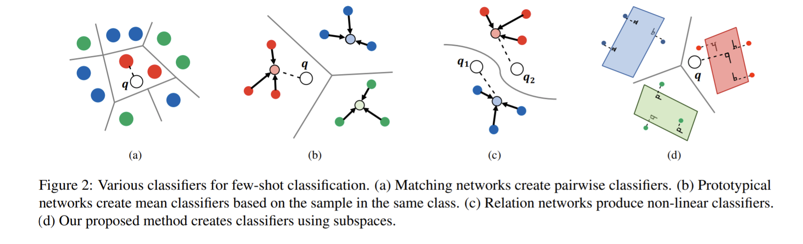
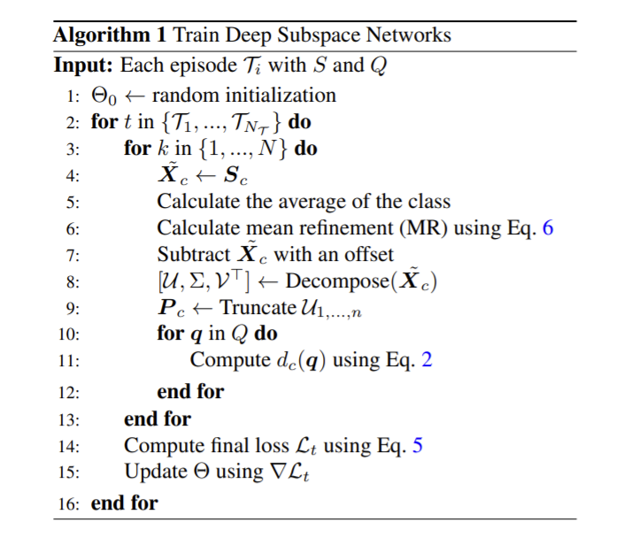
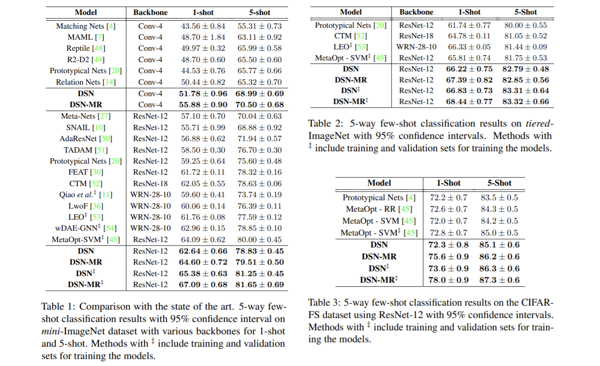
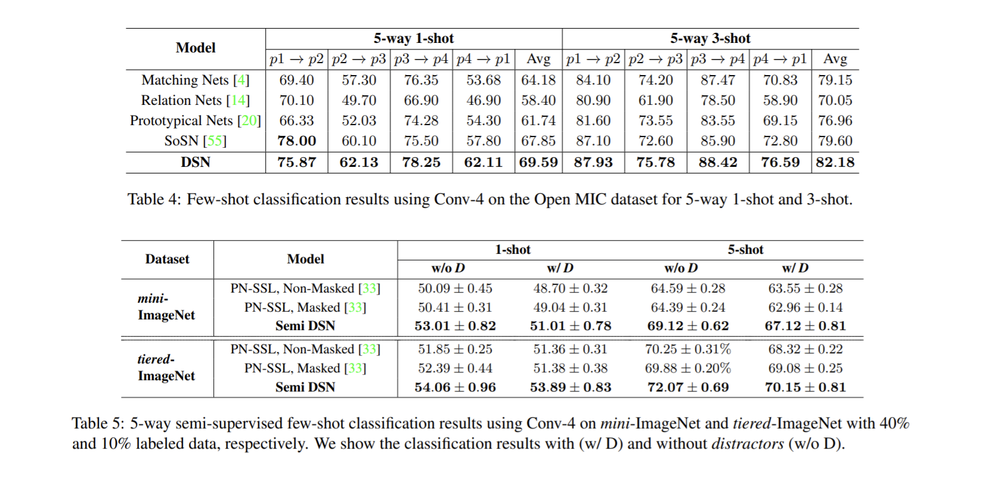
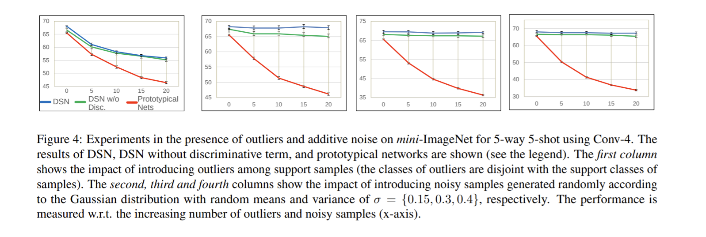
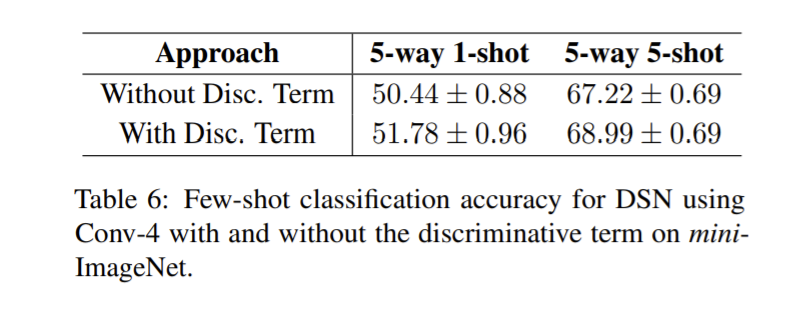

論文網址：\
[Adaptive Subspaces for Few-Shot Learning](https://openaccess.thecvf.com/content_CVPR_2020/papers/Simon_Adaptive_Subspaces_for_Few-Shot_Learning_CVPR_2020_paper.pdf)

### 概述

這篇論文是關於新的 few-shot learning 作法，做在 object recognition 的這個 task 上。有別於以往的方法（前情提要會簡單提到），這個 based on subspace 的方法在表現上面比之前都還要好，並且對於 noise 的 robustness 也非常強。這篇論文的重點如下：
* Based on subspace 的 few-shot learning 做法
* 以 semi-supervised few-shot learning 再進一步加強表現的方法

作者將他們的作法稱為 Deep Subspace Network（DSN）。

### 前情提要

因為算是第一次接觸 few-shot learning 的論文，所以有很多東西都是新東西。在前情提要的部份會簡短介紹以下的新東西（對我來說的新東西）：
* Few-shot learning 的基本概念
* Previous work
    * [Matching network](https://arxiv.org/abs/1606.04080)
    * [Prototype network](https://arxiv.org/abs/1703.05175)
    * [Relation network](https://arxiv.org/abs/1711.06025)

#### Few-Shot Learning

Few-shot learning 主要解決的是要如何用少少的資源，就能將訓練好的 model adapt 到新的 domain 上面，例如 training 只有關於動物的資料，但是希望能夠用少少的資料就能讓 model 分的清楚鳥的種類。

Few-shot 問題算是近幾年才剛開始起步的一個問題，所以 work 還相對的比較少一點。Few-shot 問題這麼重要的原因大致上有幾個：
* 在現實生活中的 task 往往難以蒐集大量的資料（例如：醫療），就算能蒐集大量資料了，之後還有「標註」資料的問題，通常給資料 label 的工作都是人工進行的（如果能自動給的話就不需要 model 了對吧），因此成本非常非常的高，所以就需要這種能在少少資料的前提下也能夠運作的方法
* 要 deploy 的產品可能會需要因應快速的變化，所以對於每一次的更動都要重新弄一個新的 model 在一些情況下幾乎是不可能的，所以就需要有能夠「快速上手」的 model
* 資源上的考量也是，如果對每一個 task 都要從頭訓練起的話，是非常浪費能源的，並且在計算資源上也不一定有辦法做的到（想像每個人都 train 一個 ImageNet 的 classifier 是多可怕的事情）

所以 few-shot learning 所關注的點可能會是：
* 如何把 model 弄成在不同 task 都很好上手的樣子
* 如何用少少的訓練資料來訓練一個 model

雖然以上兩點之間其實有一些關聯，但我認為這篇論文主要關注的是後者，用什麼樣的方法訓練，才能好好利用非常有限的訓練資料來。

這邊簡短分享一下 few-shot learning 的名詞。

Few-shot learning 的 training loop 所用的基本單位是叫做 episode。在每一個 episode 裡面，我們一次會從所有 dataset 裡面挑選 $N$ 個 class 的資料，每一個 class 選 $K+m$ 筆資料（$m$ 筆資料是要用來 testing 的）。所謂的 N-way K-shot 就是指以上的 setting，在每一個 episode 中，有 $N$ 個 class 的資料，每一個 class 都有 $K$ 筆資料是拿來 training 的。然後 support set 所指的就是 training set（$K$ 筆的部份），query set 所指的就是 testing set（$m$ 筆的部份）。

在每一個 training loop 裡面，通常都會將一個 episode 裡面的資料都看過一遍了之後再進行參數的 update（似乎大多數的 work 都是這樣）。至於 semi-supervised 的部份，就是在每一個 episode 裡面額外加上 unlabeled set 來 training（在論文中是以 $\mathcal R$ 表示）。

#### Previous Work

以下簡單的說明一下論文中有拿來比較的 previous work 他們各自都在做什麼，詳細的內容可以直接參考論文，或是看其他人寫好的文章。

**[Matching network](https://arxiv.org/abs/1606.04080)**\
這個 work 是 1-shot learning 的 work。這個 work 做的事情是把 query 拿去跟每一個 support set 裡面的資料做比較，比較出來再用加權的方式來決定 query 是屬於哪一個 class。

**[Prototype network](https://arxiv.org/abs/1703.05175)**\
這個 work 是將 centroid，也就是每一個 class 裡面的資料的平均值（重心）稱為 prototype，然後 query 離哪一個 centroid 最近就當作是那個 class。

**[Relation network](https://arxiv.org/abs/1711.06025)**\
這個 work 是把 support set 所取出來個別的 feature 拿去跟 query 的 feature 接起來（concatenate），再把整串 feature 當作輸入餵給一個 model。特點是，因為整串 feature 過了一個 NN，所以用來當作距離的 metric 是非線性的。

以下這張圖就大致上描述了那幾個 previous work 和本篇論文的關係。

### 內容

以下將會用我覺得好理解的順序來紀錄，會和論文的順序有所不同。

上面這張圖就是整篇論文的精華了，先大致說明一下上面的變數所代表的東西。
* $\mathcal T_i$：episode
* $N_{\mathcal T}$：episode 的數量
* $S$：support set
* $Q$：query set
* $N$：$N$-way $K$-shot 裡面的 $N$
* $\Theta$：feature extractor，其實就是 NN
* $\tilde {\mathbf X}$：support set 裡面所有資料取出來的 feature，以及之後的處理（之後處理的部份後面會介紹）
* $\mathbf P_c$：做完 SVD 之後，捨去一些維度的矩陣
* $d_c(\mathbf q)$：用來算 $\mathbf q$ 和第 $c$ 個 class 所張開的 subspace 的 similarity 函數

在第 5 行做的事情是算出每一個 class 的 centroid：

$$\bm \mu_c = \frac 1K \sum _{\mathbf x_i \in \mathbf X_c}f _{\Theta}(\mathbf x _i)$$

在第 6 行做的事情是把 semi-supervised 的資料也加入訓練，來得到調整過後的 centroid。先假設不知道 label 的圖取出的 feature 所代表的意義是正確的，然後就把相近的點當作是同一類的，取得新的 centroid。這邊有一個細節是新增一個 zero-mean 的 fake class，目的是要讓 noise 的 feature 不要被放進去一起算 centroid（這邊的假設是 noise 學到的 feature 是 zero-mean 的）。\
第 7 行是把 $\tilde{\mathbf X}_c$ 的 centroid 都減掉，也就是只留下以 centroid 為中心的 offset。\
第 8, 9 行應該都蠻直觀的，第 11 行的 $d_c(\cdot)$ 定義如下：

$$\begin{aligned}&d_c(\mathbf q) = -\|(\mathbf I - \mathbf M_c)(f_\Theta(\mathbf q) - \bm\mu _c)\|^2 \\
&\text{where } \mathbf M_c = \mathbf P_c\mathbf P_c^T \end{aligned}$$

我個人認為以上的式子可以理解成前面的 $\mathbf I - \mathbf M_c$ 是在把 class $c$ 所「無法張開」的 subspace 部份提取出來，再拿去和後面的 offset 乘起來。因為在還沒有 truncated 之前的 $\mathbf P_c\mathbf P^T_c$ 應該要等於 $\mathbf I$，也就是能夠張開所有維度，但是在 truncated 過後就只能張開某些維度，而這樣的資訊算是存在 $\mathbf M_c$ 裡面。我個人認為這邊的負號應該算是提前寫出來了，因為如果要以距離的概念呈現的話，應該是要越相近的越小才對，但這邊先加了負號是為了等一下要放到 exponential 函數上面來做 softmax。因此這邊的 $d_c$ 我覺得理解成 similarity 會比較好。而 query $\mathbf q$ 屬於各類別的機率如下：
$$p_{c,q} = p(c\mid \mathbf q) = \frac{\exp(d_c(\mathbf q))}{\sum _{c'} \exp(d_{c'}(\mathbf q))}$$
但是 loss function 不只是這樣，還要再加上一個「把不同 subspace 分的更開」的 term：

$$\delta^2_p(\mathbf P_i, \mathbf P_j) = \Big\|\mathbf P_i\mathbf P_i^T - \mathbf P_j\mathbf P_j^T\Big\|^2_F = 2n - 2\|\mathbf P_i^T\mathbf P_j\|^2_F$$

因為一個張開 $n$ 維 subspace 的 basis 的 Frobenius norm 的平方就是 $n$，所以就可以將式子化解成以上那樣，又因為 $n$ 是一個 hyperparameter，所以目標就變成優化後面的那個項。

最終的 loss function 如下：

$$\mathcal L(\mathbf q) = -\frac 1{NM}\sum _{c}\log(p_{c.q}) + \lambda \sum _{i \ne j} \|\mathbf P_i^T \mathbf P_j\|^2_F$$

前面的 term 就是針對分類的 loss，後面的 term 針對的就是把 subspace 分的更開。

### 結果

上面那個 row 放的結果是在不同 dataset 上面，與其他 work 的比較。其中 MR 所代表的是拿 query set 來做 centroid refinement（algorithm 的第 6 行），$\ddag$ 所代表的是把 training 和 validation 的表現也加進來一起算的結果。可以看到這篇論文的作法都是表現最好的。

下面那個 row 的左邊是對 noise 的 robustness 測試，可以看到紅色的線（prototype network）隨著 noise 幅度的增加，表現就直接下去了，但是本篇論文的表現雖然還是有影響，但幅度小很多。右邊是關於 discriminative term 對 model 表現的影響（discriminative term 就是 loss function 的後項），加入了 discriminative term 之後，表現提升了 1% 以上。

### 個人感想

這篇論文使用了 subspace 來作為 clustering 的依據，表現比單純取 centroid 還要好是可以想像的，因為直接取 centroid 的話會遺失掉很多的資訊，而運用 subspace 應該算是某種程度上去 encode 他的 residual information（那些被平均掉的資訊）。這篇論文應該也算是我第一次這麼認真的看數學式的每一個細節，雖然在 subspace 距離的原理沒有到很懂（Grassmannian geometry），不過其他地方都想的蠻清楚的，希望之後可以繼續這樣的模式。
