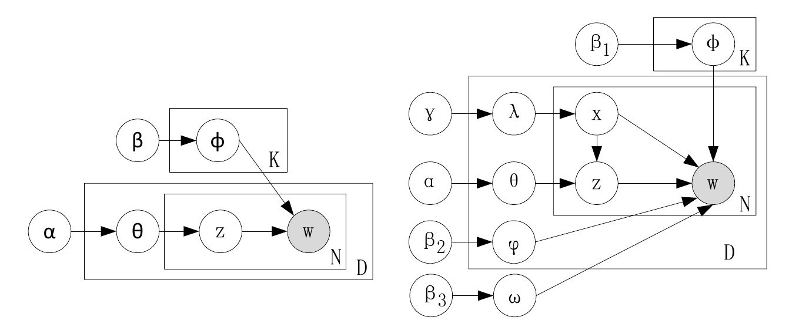
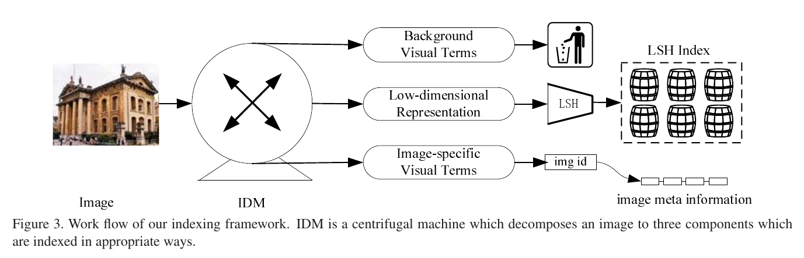
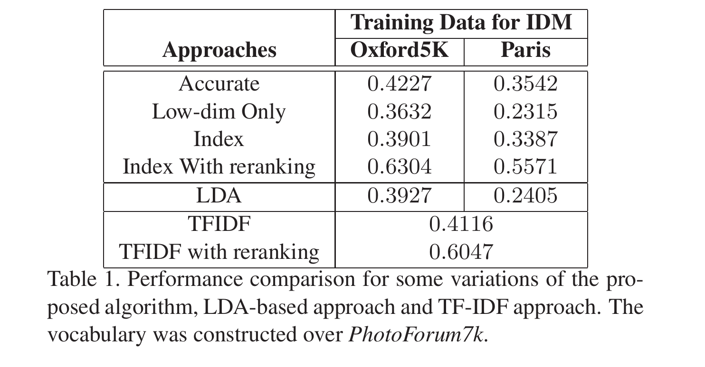
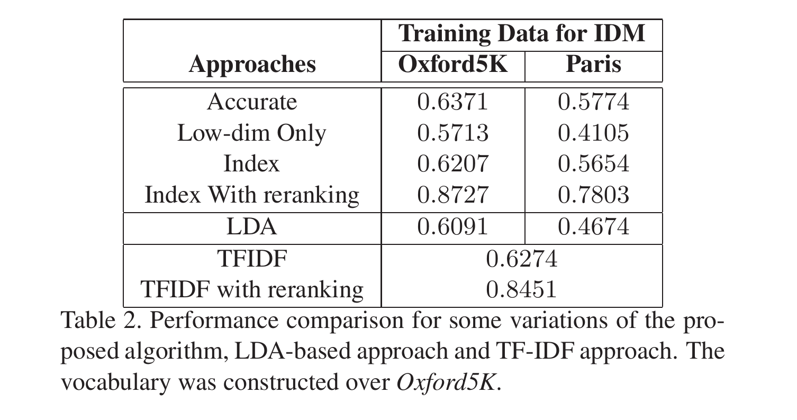
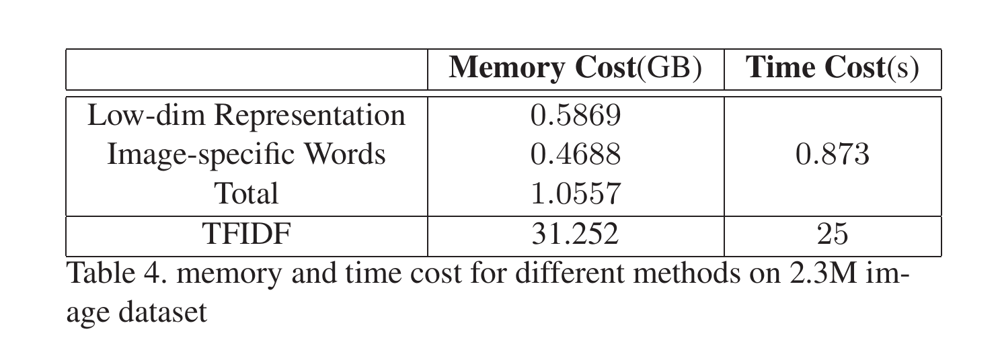

論文網址：\
[Efficient Indexing for Large Scale Visual Search](https://ieeexplore.ieee.org/document/5459354)

### 概述

這篇論文的主題是大量圖片的 indexing 和 search，要解決的問題是用圖片來 query 圖片（輸入是一張圖，希望輸出是圖片 database 中類似 query 的圖）。因為「Bag Of Visual terms（BOV）」用來表示圖片的效果非常好，所以也就被用來做圖片 indexing 和 search。但作者在本篇論文中說明現有方法（例如：inverted list）只在文字的 query 上面可行，搬到圖片的 query 上就不太可行，因此就提出一個新的針對圖片 query 的 indexing 的 representation。

順帶一提這篇論文是在 2009 年的 ICCV，他的明年，也就是 2010 年， [VLAD](https://ieeexplore.ieee.org/document/5540039) 這篇論文就被發表了。兩篇論文的內容都有關於 indexing 的部份，並且我認為他們兩篇 paper 所使用的方法其實是基於蠻類似的概念（用大方向的分類來做最初步的 feature，再透過額外保留的 residual information 來更細節的分類），有興趣的讀者可以參考一下。

這篇論文的 novelty 應該是看似簡單的概念，但卻有很好的效果：
* 將 representation 分成大方向的部份以及細節的部份，在搜尋的時候先搜尋大方向的部份獲得第一次的結果，再從第一次的結果中，根據細節的部份來挑出和ˋ query 最符合的結果

### 前情提要

這個部份簡短分享一下以前的方法為何在圖片上就不可行、image retrieval system 的基本架構，以及 topic model 的 high level 概念（對 topic model 更深的討論可以參考本文的參考資料）。

#### 舊方法為何不可行

舊的問題是：我們想要透過輸入的幾個 term 來找到相關的圖片。這個問題可以透過 inverted list，也就是紀錄每一個 term 所對應到的所有圖片，來解決。搜尋的時候只要找出每一個 query 裡面的 term 對應到的所有 row，再做交集就可以了。但是這可行是建立在「query 只有短短幾個 term」的這個假設上，如果場景換成圖片作為輸入的話，query 就會變成幾千個 term（用 visual word 來表示一張圖片）。如果真的拿幾千個 term 的 row 來做交集的話，時間複雜度和空間複雜度都是無法被接受的高。

並且如果直接拿 BOV vector 去 hash 的話，很可能會有不好的結果，因為維度太高會使得距離的計算沒有實質上的意義（curse of dimensionality），所以會使得 LSH 等等的 hash 方法不可行。雖然直接將那麼高維的 vector 先降維成低維度的話，就可以使用 LSH 了，但降維又會遺漏了一些細節上的資訊，因此不能直接降維。

#### Image Retrieval System 的基本架構

大致上可以將 image retrieval system 分成三個部份：
1. feature 的提取和 quantization
    取出圖片的 local feature，再用分群方法把所有 feature 分成 visual word
2. indexing
    預先計算好在 inference 時會用到的資訊，例如先把東西 hash 好，等到 inference 的時候就可以直接使用
3. postprocessing
    找到結果之後就可以使用額外的工具再把結果整理一次（例如 RANSAC、query expansion）

#### Topic Model

topic model 是一種 generative model，目的是想要找出一個資料庫裡面的所有文章裡面所出現的詞、主題等等的關係。最常見的 topic model 是 Latent Dirichlet Allocation（LDA），幾乎所有講到 topic model 的文章都是有關 LDA 的。我覺得 topic model 的假設非常有趣，它假設文件生成的機制是：
1. 文章作者先在心裡想好了那篇文章所要包含的幾個主題
2. 文章的作者會從那些主題裡面選一些詞出來用
3. 那些詞就組成了一篇文章

而 topic model 所要做的事情就是透過大量的觀察（隨機抽樣）資料庫裡面的文章，來得到他們背後的 distribution（posterior distribution）。

### 作法

這篇論文提出的作法可以用兩種方式來達成，一種是常見的矩陣降維方法（例如 PCA），第二種是 topic model。作者認為雖然矩陣的降維方法比較容易計算和使用，但是 topic model 在 generalization 上表現的比較好，因此這篇論文大篇幅的說明都是有關 topic model 的。

我們想要做好的目標函數：

$$\min\sum_{i=1}^N\|p_i-Vh_i\|$$

其中 $p_i$ 代表的是原本的 BOV vector，$V$ 代表從低維投影回去高維的矩陣，$h_i$ 代表的是我們經由 $V$ 所得到的低維 vector（$h_i=V^Tp_i$）。在前情提要部份有提過的「細節資訊」會因為被投影到低維的空間所以遺漏：
$$p_i = Vh_i+\epsilon_i$$
$\epsilon_i$ 就是用來分辨圖片細節的資訊。如果用矩陣的理解方式的話，就能很容易的理解上方這兩個式子的意義，所以接下來會主要是有關 topic model 的部份。

論文中使用的 topic model 是 Image Decomposition Model（IDM）。它和 LDA 的不同之處是將 visual word 的 generation 分成更細的分類。LDA 所假設的只有「抽出一個 topic，再從 topic 裡面選詞出來」；而 IDM 把詞的 generation 分成：
1. topic distribution：$\phi_z$
2. image-specific distribution：$\psi_d$
3. background distribution：$\omega$

以例子來說明以上三種 visual word 的不同：一張客廳的圖片和廚房的圖片，他們的 topic 可以說都包含了 indoor；而 image-specific 的部份對於客廳的圖片來說，應該就是沙發、電視、客廳的擺設等等，對廚房的圖片來說應該就是菜刀、鍋具等等的；而 background 的部份就是所有無法有意義的分辨圖片的 visual word，比如說地磚的「白色」，白色可能是牆壁、花、白雲，所以這類的資訊對於分辨圖片就沒有什麼幫助，但卻也是組成一張圖片必要的元素（還是得為地磚塗上一種顏色）。

IDM 的 generation 方法是：
1. 先抽出一個 $x$
2. 如果 $x=1$，就抽出一個 topic $z$，再從 topic $z$ 的 distribution $\phi_z$ 裡面選一個 visual word 出來
3. 如果 $x=2$，就從 image-specific distribution $\psi_d$ 裡面選一個 visual word 出來
4. 如果 $x=3$，就從 background distribution $\omega$ 裡面選一個 visual word 出來

如果曾經有接觸過 plate notation 的話，可以參考下面這張圖，如果沒有也沒關係，上面的文字敘述就是在說明這個 plate notation 所做的事情。

有了以上的設定之後，就可以使用 Expectation Maximization（EM）的演算法來近似以上 model 的 parameters。作者使用的是 collapsed Gibbs sampling，但因為過程繁瑣而且也不是本論文的重點，所以本文就先跳過這個部份。

上方這張圖說明了如何利用 IDM 所得到的三種 distribution 來做 indexing。background visual terms 是被丟棄不用的，而 topic distribution $\phi_z$ 是被拿來 hash 的部份，image-specific visual terms 是拿來分辨同一個 topic 的圖片之間的不同。在 inference 的時候，就是先用 LSH 找到一些類似 topic 的圖片之後，再用 image-specific 的資訊來找到和 query 最相關的圖片。聽起來是很直觀的想法，但在表現上真的有很好的提升。

### 結果

以下的表格前四個 row 分別代表的是：
* 直接計算所有圖片和 query 的 similarity
* 只用 LSH hash 的部份來 ranking
* 加上 image-specific 的資訊
* 加上 image-specific 資訊之後再 reranking

可以看到在加上 image-specific 資訊之後，表現就能幾乎和 state-of-the-art 的 TFIDF 一樣好了，再加上 reranking 之後，又有更大的提升，這表示加上 image-specific 資訊之後的 recall rate 是比 TFIDF 還要高的。

TFIDF 雖然是 state-of-the-art 的作法，但是在 memory 和 time 的成本上都大的很誇張，以下這張表就顯示了作者提出的方法與 TFIDF 之間的 cost 差距。

### Contributions

* 提出一個比 TFIDF 效率還要高，而且表現也比 TFIDF 還要好的方法
* 將 ranking 拆成兩個步驟，先把大方向的資訊 hash 起來之後，再用細節的資訊來分辨類似圖片之中的不同

### References

* https://ieeexplore.ieee.org/document/5540039
* https://towardsdatascience.com/dirichlet-distribution-a82ab942a879
* https://blog.rosetta.ai/a-deep-dive-into-latent-dirichlet-allocation-lda-and-its-applications-on-recommender-system-e2e8ea5e661c
* https://blog.rosetta.ai/%E6%B7%B1%E5%85%A5%E6%8E%A2%E8%A8%8E-latent-dirichlet-allocation-lda-%E8%88%87%E5%9C%A8%E6%8E%A8%E8%96%A6%E7%B3%BB%E7%B5%B1%E4%B8%8A%E7%9A%84%E6%87%89%E7%94%A8-2441d57ecc8a
* https://taweihuang.hpd.io/2019/01/10/topic-modeling-lda/
