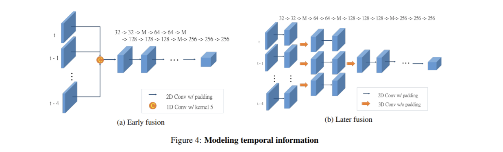
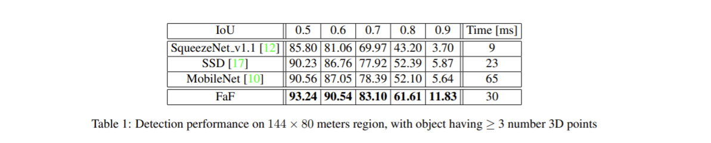
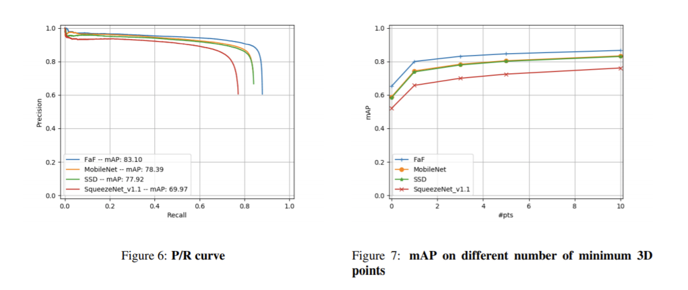
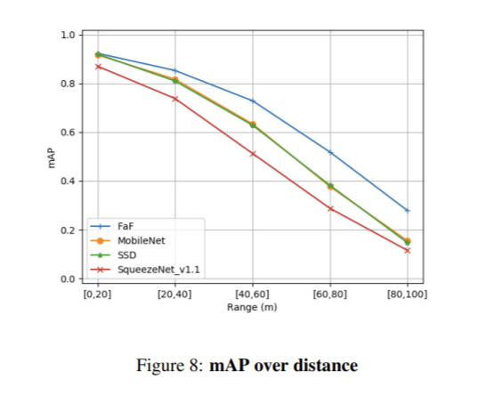
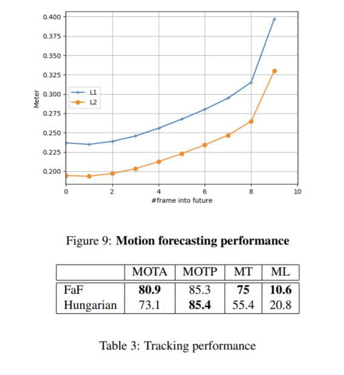
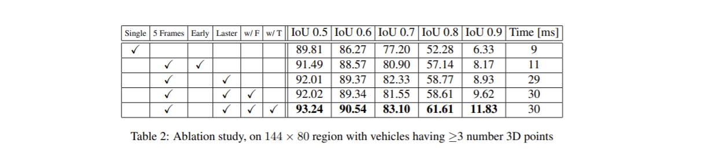

論文網址：\
[Fast and Furious: Real Time End-to-End 3D Detection, Tracking, and Motion Forecasting with a Single Convolutional Net](https://arxiv.org/pdf/2012.12395.pdf)

### 概述

這篇論文是 Uber 團隊在 2018 年的 work，內容是關於一個集大成的 network，包含了 detection、tracking 和 forecasting 的能力（論文的 title 就有寫了）。在自駕車的應用場域中，inference 的速度必須要非常快才可以即時針對快速變化的路況做出判斷，但同時也不能犧牲準確度。這篇論文提出的方法可以在 30 ms 之內做完以上三個 task，而且準確度也不輸 state-of-the-art。

這篇論文的標題非常顯眼，應該是以電影玩命關頭來取名的，想必應該是有很好的結果才敢這樣取名字。並且寫這篇文章的時候正值玩命關頭9的宣傳時期，所以感覺又更有趣了。這篇論文的重點如下：
* FaF network 的架構
* 他們是如何把計算的時間節省下來的

作者將他們的方法稱為 FaF（Fast and Furious）。

### 前情提要

在自駕車的應用中，差不多可以將任務分成四個大部份：
1. detection
2. object tracking
3. motion forecasting
4. motion planning

而這篇論文提出的 network 能一次包辦前三個 task。這個部份簡單的紀錄一下 2D object detection 以及 3D object detection 的重點。

#### 2D Object Detection

2D 的 object detector 可以被分為兩類，一類是 one-stage 的，另一類是 two-stage 的。他們之間的不同主要是在：
* two-stage 的 detector 會將問題分成兩步驟，第一步是先找出可能有 object 的區域，第二步是判斷第一步所找出的所有區域之中，是否有物品的存在
* one-stage 的 detector 就是直接 end-to-end 的掃過每一個區域，並同時判斷是否有 object

以前 one-stage 的 detector 無法被 train 起來一個很大的原因是 positive sample 和 negative sample 的比例太不平均的，一次掃過去的話，大部份得到的都是 background，這樣就會讓 model 很傾向於 output background。但在這個問題被解決之後，one-stage 的表現就不比 two-stage 還要差了，並且還比較好 train（end-to-end，所以不用分開 tune 兩個 model）、速度上也比較快。

關於其中一種 one-stage 的 detector，RetinaNet，我曾經寫過一篇[筆記](https://vincentthh35.csie.org/p/fcos-fully-convolutional-one-stage-object-detection/)，有興趣的讀者可以參考。

#### 3D Object Detection

3D 的資料表示方法並不像 2D 的，就是一張圖片那麼簡單而已，有很多種方式可以用來表示一個 3D 場景，例如 voxel（pixel 的 3D 版本）、point cloud（用 RADAR 或 LiDAR 掃場景獲得的稀疏點組成的資料）。這篇論文使用的輸入是後者，但是在計算過程是用 point cloud 轉成的 voxel 的 convolution，以往的 work 主要是因為 3D convolution 的成本太高了，不管是在參數或是 inference time 的成本都非常高。這篇論文巧妙的運用對場景不同的解讀方式來讓 computation cost 降低，來達到 read-time 的 inference。

### 內容

首先先把 bird-eye view 的 point cloud 轉換成 convolution 可以操作的形式，voxel。但是在轉成 voxel 之後，作者之後做的不是 3D 的 convolution，而是 2D 的 convolution，把 point cloud 的高度資料當作 input feature（就是 input channel），這樣去做 2D convolution。接著就是如何要把 temporal 維度的資料整合起來了。

這邊作者有兩種方法來結合時間序列的資訊，參考下圖。一種是比較快速，但是準確度稍微低一點點的（左邊的方法），另一種是要算比較久一點，不過有比較高的準確度。
* 左邊的方法被稱為 early fusion，意思是早早就把 temporal 的資訊整合起來。這篇作者是直接用一個 1D 的 convolution（其實就是把每一個 frame 做線性組合）。後面的就直接參考 VGG 的架構，用 2D convolution 來取得 feature。
* 右邊的方法被稱為 later fusion，就是晚點整合 temporal 的資料。和 early fusion 不同的是，這個方法沒有在一開始就把所有 frame 的資料整合在一起，而是一邊 convolution 一邊整合。在整合不同 frame 資料的時候，就必須使用到 3D convolution，所以會讓時間比較慢一點。不過這樣的好處是能夠把比較細緻的 feature 計算出來。

最後再把取出來的 feature 拿去分別作 detection 和 classification。

在 detection 方面，這篇論文採用的是有 anchor 的，也就是先預設好 bounding box 的比例，讓 model 去做 regression，得到 offset 和尺寸。

在 tracking 方面，因為 model 的輸入就包含了好幾張連續的 frame，所以要 tracking 和 forecasting 都不是很難的事情。對於不同 frame 取得的 object 位置，作者會把他們平均，如果 bounding box 有 overlapped 的話，就當作是同一個物品，如此一直紀錄下去。

他們的 loss function 就比較一般，是很中規中矩的 loss function，就是把 classification 和 regression 的 loss 加起來而已：

$$\ell(w) = \sum \Big( \alpha \cdot \ell_{\text{cla}}(w) + \sum_{i=t,t+1,\cdots,t+n} \ell^t_{\text{reg}}(w) \Big)$$


這篇論文是 train 在他們自己蒐集的 dataset 上面，是 KITTI dataset 的兩個數量級倍數的大小。他們強調這個 dataset 的 train 和 test set 地點是分開的，目的是要測試 model 的 generalization 能力。

### 結果

下圖是跟其他改造過的 2D detector 比較的結果。雖然速度並不是最快的，但表現是最好的。（速度也是非常快了，被拿來比較的 baseline 都是以 model 精簡聞名的）

可以看到在 P/R curve 和 mAP curve 上面，這篇論文的表現都比其他 baseline 還要好。在 mAP 的圖裡面有個比較特別的地方是預測 0 個點的 object，這是為了測試 model 有沒有把 temporal 的資料也納入考量，因為有些 object 可能會因為視角的緣故而被擋住，這時候就需要前幾個 frame 的資訊，才能判斷該物體在哪裡。

他們也測試了 model 對不同遠近的 object 的準確度，表現也都比其他 baseline 還要好。

最右邊的上圖是 model forecast 和 ground truth 的距離，分別取 L1 和 L2 距離的結果。這個 model 可以猜出 9 個 frame 以後的物體，而差距只有 30 幾公分，可以說是非常不錯的預測表現。

最後就是 ablation study 的表格了。首先最左邊的是只用一個 frame 的，再來是使用 5 個 frame、early fusion、later fusion、加入 forecasting loss、加入 tracking loss。論文這邊沒有寫出 prediction loss 是什麼樣的，不過在加入新的 task 之後，model 的表現還可以往上提升這件事情是 multi-task learning 的核心概念，因為要用同一組 feature 來達成所有的目標，所以我們會期待 model 學到的 feature 是足夠 generalized 的。

下圖是和另一個 baseline 比較在 KITTI dataset 的 metric 上面。除了第二欄之外，其他都是大獲全勝，而輸掉的第二欄也是小輸而已，足以證明這篇論文的 model 是真的表現很好。

