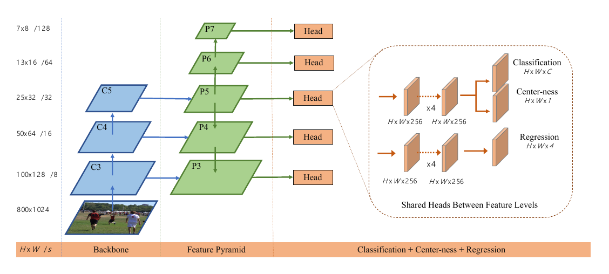
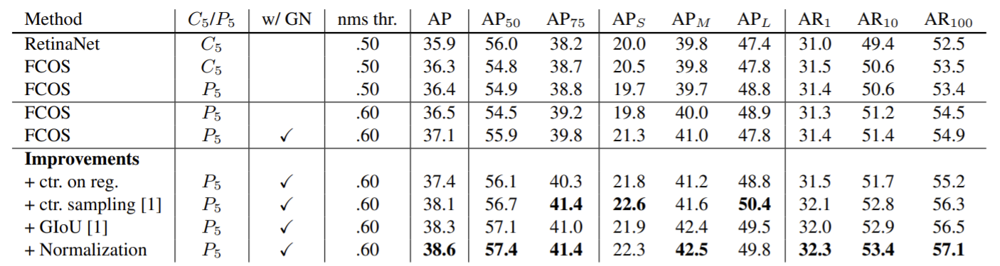

（以下的內容如有冒犯之處，敬請來信告知。）

### 概述

這篇論文[^1]的內容是 FCOS，一個 one-stage object detector。其特別之處在於 anchor-free 的性質。大部分的 object detector 都是 two-stage 的架構：先使用固定比例的 anchor box 找出可能有物品的 proposal 之後再對 proposal 的 anchor box 做 regression；雖然 two-stage 的架構有許多好處，但也有以下的幾個壞處：
1. model 的表現很仰賴於 anchor box 的比例和數量，所以多了很多麻煩的 hyperparameter
2. 因為是使用固定的 anchor，所以對於一些形狀不固定的物品就難以被偵測
3. 為了能夠表現好一點，通常就會將 anchor box 密集的擺在圖片上，但這樣就會使得 positive examples 和 negative examples 的數量失衡（positive 代表有物品，negative 代表是背景）
4. 在 training 過程，使用 anchor box 會需要進行很多複雜的運算，例如：和 ground-truth 的 anchor box 計算 IoU（Intersection over union）

然而 FCOS 不只是 one-stage detector，而且還不需要 anchor box。列出以下的幾個優點：
1. Simple. 因為不需要 anchor 和 proposal 了，因此 hyperparameter 的數量大大降低
2. Fast. 因為不需要計算與 anchor box 相關的數值（與 ground truth 的 IoU 等等），所以在 training 的速度上是比較快的
3. State-of-the-art performance. FCOS 表現不只是比 one-stage detector 還要好，也比 two-stage detector 好

### 方法

#### 1. 架構

FCOS 的架構是 based on 一個 backbone CNN（論文中大多數的例子都是使用 ResNet-50[^2]），然後使用 Feature Pyramid Network（FPN）[^3]取出不同 scale 的 feature，最後再交給後面的 layer 來做 classification 和 regression。更詳細的架構可以參考他們的 [github](https://github.com/tianzhi0549/FCOS)。

#### 2. Loss Function

在說明 loss function 之前，要先看看他們怎麼定義一個 bounding box：

$$\text{ground-truth} = \{B_i\}, \text{where }B_i = \Big(x_0^{(i)}, y_0^{(i)}, x_1^{(i)}, y_1^{(i)}, c^{(i)}\Big) \in \mathbb{R}^4\times \{1,\cdots,C\}$$

$(x _0^{(i)}, y _0^{(i)})$ 代表的是左上角的座標，$(x _1^{(i)}, y _1^{(i)})$ 是右下角的座標，$c^{(i)}$ 代表該 bounding box 的 class。\
並且對於圖片中的每一個點 $(x,y)$，都指派一個 ground-truth bounding box 給它，然後以一個四維的向量 $\mathbf t _{x,y}$ 表示：
$$\begin{aligned}& l^* = x - x _0^{(i)},& t^* = y - y _0^{(i)} \\ & r^* = x _i^{(i)} - x,& b^* = y _1^{(i)} - y \end{aligned}$$
如果一個點落入了很多個不同的 ground-truth bounding box，則指派最小的一個 bounding box 給它。\
但是這樣還不夠，因為作者們在實驗了之後，發現這樣會做出太多不準確的 bounding box，所以再定義一個 centerness 來把一些距離中心太遠的 bounding box 的影響力降低：
$$\text{centerness} = \sqrt{\frac{\min(l^*, r^*)}{\max(l^*,r^*)} \times \frac{\min(t^*, b^*)}{\max(t^*,b^*)}}$$
可以發現到這個值隨著 $l^*,r^*$ 的值相差越大，則越接近 0（$t^*,b^*$ 亦同）。這個 centerness 在 training 階段是用來加入 loss function 的（以 Binary Cross Entropy loss 的形式）；在 testing 階段是用來乘以 classification score 的，達到 down weight 不準確 bounding box 預測結果的效果。\
Loss function：

$$\begin{aligned}L(\{\mathbf p_{x,y}\}, \{\mathbf t_{x,y}\}) &= \frac{1}{N_{\text{pos}}}\sum_{x,y}L_{\text{cls}}(\mathbf p_{x,y}, c^*_{x,y})\\
&+\frac{1}{N_{\text{pos}}}\sum_{x,y}[ c^* _{x,y} > 0 ]\cdot L_{\text{reg}}(\mathbf t_{x,y}, \mathbf t^*_{x,y}) \\
&+ \frac{1}{N_{\text{pos}}} \sum_{x,y}\text{BCELoss}(\text{centerness}) \end{aligned}$$

* $\mathbf p _{x,y}:$ 在 $(x,y)$ 那一點上面的 class 的 one-hot encoding
* $\mathbf t _{x,y}:$ 在 $(x,y)$ 那一點上面的 predicted bounding box vector（$\mathbf t^*$ 是 ground-truth bounding box）
* $N_{\text{pos}}:$ positive example 的數量
* $L_{\text{cls}}:$ RetinaNet[^4] 中的 Focal loss
* $L_{\text{reg}}:$ IoU loss（對 IoU 的值取 $-\ln$）

#### 3. Evaluation

上方的表格是 FCOS 在做了各種加強之後與 RetinaNet[^4]的比較。最原始的 FCOS 的 loss function 其實是沒有 centerness 的設計的，在上表也能看出 centerness 對於加強 performance 是相當有效的。
* GN：Group Normalization
* ctr. on reg.：把架構中 centerness 的分支和 regression 合併
* ctr. sampling：只取距離中心點近的 bounding box
* GIoU：使用 GIoU 取代 IoU
* Normalization：對 $\mathbf t$ 做 normalize

詳細的內容請參考他們的 [github](https://github.com/yqyao/FCOS_PLUS)

### Insights, Strengths and Weaknesses

* Insights：
    * Centerness 有效的避免掉偏移中心點太遠的 bounding box
        * 因為 centerness $\in[0,1]$，所以可以使用 BCELoss 來作為 loss function
    * 每一個點都能做為 regression 的 target，所以能有較多的 data 來 training
* Strengths：
    * 不需使用 anchor box，避免掉 hyperparameter 的麻煩以及複雜度
    * 架構不複雜
* Weaknesses：
    * 暫時還沒發現弱點 QQ

[^1]: [FCOS: Fully Convolutional One-Stage Object Detection](https://arxiv.org/abs/1904.01355)
[^2]: [Deep Residual Learning for Image Recognition](https://arxiv.org/abs/1512.03385)
[^3]: [Feature Pyramid Networks for Object Detection](https://arxiv.org/abs/1612.03144)
[^4]: [Focal Loss for Dense Object Detection](https://arxiv.org/abs/1708.02002)
