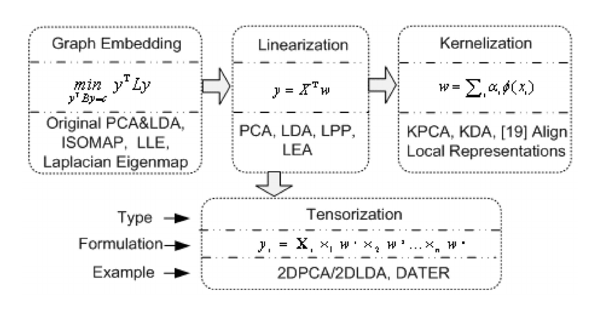
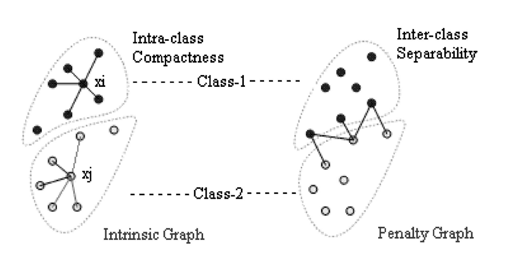
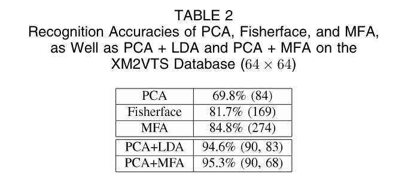
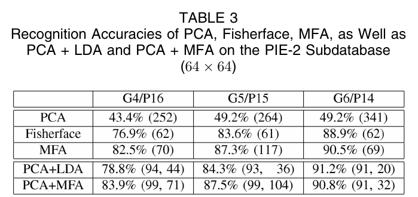

論文網址：\
[Graph Embedding and Extensions: A General Framework for Dimensionality Reduction](https://ieeexplore.ieee.org/document/4016549)

### 概述

如何降低輸入資料的維度，並同時保持資料之間的相對關係是一個很關鍵的問題，因為某些資料類型的維度非常高，例如圖片，難以不透過任何轉換來得到有用的資訊。這篇論文提出了一個以 graph 為基礎的 general framework 來整合各種降維方法，並且提出了一個新的作法，Marginal Fisher Analysis（MFA）。

### 內容

#### General Framework for Dimensionality Reduction

作者將降維的方法分為四個類別，分別是：
* graph embedding
* linearization
* kernelization
* tensorization

它們之間的關係可以參考下方的左圖：

以 graph embedding 的角度來看降維問題的話，就是先做出一個 $W$ 矩陣來代表所有資料點之間的關係（以 adjacency matrix 來表示）。

**graph embedding**\
目標函數：

$$y^* = \argmin_{\text{constraint}} \sum_{i\neq j}\|y_i - y_j\|^2 W_{ij} = \argmin_{\text{constraint}} y^TLy$$

其中 $L$ 是 $W$ 的 Laplacian Matrix，$W_{ij}$ 代表的是 $x_i, x_j$ 之間的 similarity，$y$ 是將原資料 $x$ 降低維度之後的 vector。能被歸類在這個類別的方法的不同點是在 constraint 的不同。上面的算式可以理解成 $W_{ij}$ 越大的話，$y_i, y_j$ 之間的距離就要越小（因為 $W$ 代表的是 similarity），反之也是，因為 $W$ 可能是負的所以當 $y_i, y_j$ 之間的距離越大，就能讓目標函數越小。本篇論文最關鍵的算式用類似的理解方式去想就會變得很簡單。而最右邊的那個等號關係其實是：
$$\sum_{i\neq j}\|y_i - y_j\|^2 W_{ij} = \frac12 y^TLy$$
不過因為是求 $\argmin$ 所以可以把常數倍數拿掉。

**linearization**\
這個類別是先假設 graph embedding 之中，將 $x$ 轉換成 $y$ 的過程是可以用一個 $w$ 矩陣做到的。因此把目標函數裡面的 $y$ 換成 $w^Tx$ 就變成了新的目標函數：

$$w^* = \argmin_{\text{constraint}} \sum_{i\neq j}\|w^Tx_i - w^Tx_j\|^2 W_{ij} = \argmin_{\text{constraint}} w^TXLX^Tw$$


**kernelization**\
因為直接用線性的轉換可能會無法好好的處理非線性可分的資料，所以在那些情況之下使用 kernel 就會比線性的轉換還要來的好。目標函數：

$$\alpha^* = \argmin_{\text{constraint}} \sum_{i\neq j}\|\alpha^TK_i - \alpha^TK_j\|^2 W_{ij} = \argmin_{\text{constraint}} \alpha^TKLK^T\alpha$$

其中 $K$ 是 kernel Gram matrix，$K_{ij} = \phi(x_i)\cdot\phi(x_j)$

**tensorization**\
tensorization 其實就是將 linearization 推廣到更高維度的情況。但通常沒有 close form solution，所以要透過 iterative 的方法來求解。順帶一提，除了 tensorization 之外的其他三種方法，都有 close form solution（eigenvalue decomposition）。

#### Marginal Fisher Analysis（MFA）

MFA 想要達成的目標有兩個：
* **intra**class 的點要儘量的靠近
* **inter**class 的點要互相的遠離

作者提出了 intrinsic graph 和 penalty graph 的概念，可以參考在上一個區塊的圖。intrinsic graph 裡面的邊是和「最接近自己的其他**相同** class 的 $k_1$ 個點」所連接起來的；penalty graph 裡面的邊是和「最接近自己的其他**不同** class 的 $k_2$ 點」所連接起來的。

目標函數：
$$w^* = \argmin_{w} \frac{w^TX(D-W)X^Tw}{w^TX(D^p - W^p)X^Tw}$$
分子代表的就是 intraclass compactness，而分母代表的就是 interclass seperability。同時要讓 intraclass 的點之間的距離很小，也讓 interclass 的點之間的距離很大，所以是取 $\argmin$。

MFA 的流程：
1. 先用 PCA 降低維度
2. 最佳化上面的目標函數
3. 得到結果

#### Evaluation

在大多數的情況下，作者提出的 MFA 表現都是最好的。

### Observation

作者提出了幾個有趣的觀察：
* kernel 版本的 MFA（KMFA）比原本的 MFA 還要來的好，顯示了非線性轉換的必要性
* 對於一開始的 PCA，嘗試不同的維度會表現的好很多
* 隨著 training sample 的數量增加，每一個方法之間的表現差距就會變小，由此可知 training data 的量對於表現有關鍵性的影響

### Contributions

* 和 LDA（linear discriminant analysis）的比較：
    * 不需要對 data distribution 的假設（LDA 假設高斯分佈的 data distribution）
    * MFA 的 available projection 方向比 LDA 的多（這樣就不會使投影後的 variance 集中在某一些維度）
    * 不需要對 data distribution 有假設就能把 interclass 之間的 seperability 做好
* 提出了一個 general framework 有系統地整合了各種降維方法
