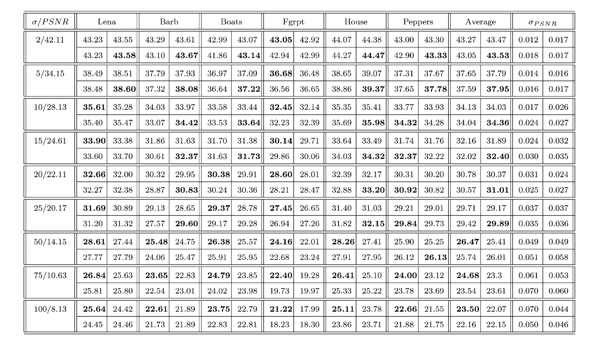

論文網址：\
[Image Denoising Via Sparse and Redundant Representations Over Learned Dictionaries](https://ieeexplore.ieee.org/document/4011956)

### 概述

這篇論文的內容是討論 sparse coding 在 image denoising 上的應用。主要的 novelty 主要有以下兩個：
1. 將 local sparsity and redundancy 用在最佳化 global 的目標函數上
2. 將 sparse coding 的 dictionary 用學的學出來

相較於以前的 work，通常都是使用固定的 dictionary，這篇論文提出了從 example 之中學習 dictionary 的方法，預期能夠學到比固定 dictionary 還要好的 dictionary。

### 前情提要

這個部份會先介紹一些關於 sparse coding、MAP （Maximum A Posteriori）以及 K-SVD 的先備知識。

#### Sparse Coding

Sparse coding 之所以被稱為 sparse coding 的原因就是強調他 coding 的 sparsity。通常我們在 encode 一個 $n$ 維的向量的時候，我們只要 $n$ 個向量就可以 encode 它（線性的組出原本的向量），但 sparse coding 的特點就是使用 redundant 的 dictionary，也就是說 dictionary 裡面的向量之間不是 linearly independent 的。並且在 encoding 的時候，通常都會加上一個 $L_0$ 或是 $L_1$ 的 regularizer，來使得 encode 出來的結果是 sparse 的。相對於 PCA，我們想得到的是以最少的向量來表示資料，sparse coding 想達成的目標幾乎可以說是相反的，是想要用很豐富的 dictionary 但卻 sparse 的 representation 來表示資料。

以數學式來說的話，就是有一個 dictionary $\mathbf D$，然後我們要用 $\bm\alpha$ 乘上 $\mathbf D$ 來逼近一個 $n$ 維的 $\mathbf x$：

$$\begin{aligned} \hat{\bm\alpha}&=\argmin_{\bm\alpha}\|\bm\alpha\|_0 \text{ subject to } \mathbf D\bm\alpha \approx \mathbf x \\
&\text{where } \|\mathbf D\bm\alpha - \mathbf x\|_2 \le \epsilon,\ \|\hat{\bm\alpha}\|_0 \le L \ll n \end{aligned}$$


#### Maximum A Posteriori

關於比較細節的說明可以參考[這篇文章](https://zhuanlan.zhihu.com/p/32480810)，這邊分享的是我簡易版的理解。首先，在統計學裡面有兩個學派，一個是「頻率學派，Frequentist」，而另一個是「貝葉斯學派，Bayesian」。頻率學派主張我們看到的資料背後其實是有一個「正確的 distribution」，而 Bayesian 所主張的是，在 distribution 背後的那些參數，其實也都是隨機變數，而不是固定的條件。而這樣的前提都是為了去「猜」出我們看到的資料背後所暗藏的 distribution 以及它相對應的參數到底是長怎樣的。

頻率學派所使用的估計方式是 Maximum Likelihood Estimation（MLE）；Bayesian 所使用的估計方式是 Maximum A Posteriori（MAP）。那這兩種主張會有什麼差別呢？我個人的理解是，以 MLE 所估計出來的答案（distribution 的樣子）是不考慮該「答案」出現的可能性的，也就是說，就算我們所觀察到的事件使用 MLE 所猜出來的 distribution 長的很奇怪，MLE 也會把它當作答案；而 MAP 因為還會考慮到 distribution 的 prior probability，所以我覺得在意義上有一點像是 regularizer，在最小化目標函數的同時也會顧及到答案是否那麼可能會發生。

不過在資料量夠大的情況下，兩種方法所得到的結果會非常接近，所以兩者之間其實也沒有絕對的好壞。

以下是他們分別的數學式：

$$\begin{aligned}\hat \theta_{\text{MLE}} &= \argmin_{\theta}-\sum_{i=1}^{n}\log P(x_i; \theta) \\\\
\hat \theta_{\text{MAP}}&=\argmin_{\theta}-\log P(X | \theta) - \log P(\theta)\end{aligned}$$


#### K-SVD

這邊分享的也是我個人簡易的理解，詳細的數學式可以參考[維基百科](https://en.wikipedia.org/wiki/K-SVD)，只要稍微對調一下符號就能和論文中的 notation 對應。K-SVD 的步驟如下：
1. 先將 $\mathbf D$ 固定著，用 pursuit algorithm 來找出一個 $\bm\alpha$ 的近似解。（因為要找出 $L_0\text{-norm}$ 的最佳解是 NP-Hard 的問題，所以取而代之的找到近似解）
2. 對於 dictionary 裡面的每一個 column 都做以下的事情：
    * 計算「除了第 $i$ 個 column 以外的所有 column 做出的東西和目標的差距」
    * 用 SVD 分解上述的「差距」
    * 以最大的 singular value 所對應的 column 來更新 dictionary 的第 $i$ 個 column，以及 $\bm\alpha$ 相對應的 entry
3. 返回第一步重複

### 內容

這篇論文中的方法和 [K-SVD](https://ieeexplore.ieee.org/document/1710377) 非常相似，因此如果有 K-SVD 的知識背景的話，要理解本篇論文會相對容易很多。本篇論文提出了兩種方法，一種是以乾淨沒有 noise 的圖片來學 dictionary，另一種是直接學在有 noise 的圖片上。本篇論文所使用的 noise 都是高斯 noise，強度以 $\sigma$ 來表示。先介紹比較簡單，學在沒有 noise 圖片上的方法。

要把 sparse coding 運用在比較高維度的資料上的話，不能直接使用高維度的 dictionary，因為太高維度的 dictionary 要達成 sparse coding 的目的的話，就必須要有非常大量的 code，可以試著想像一下，如果我們要找出 256 * 256 圖片的 dictionary，那我們就會需要大於 256 * 256 個 code，比較不切實際。所以本篇論文的替代方案是學出 8 * 8 的 code，拿那些 code 去掃過圖片（類似卷積）來得到每一次的 $\bm\alpha$。最後得到的結果再平均，因為掃過的範圍會有重複的部份。

#### 以沒有 noise 的圖片來學 dictionary

因為輸入的圖片沒有 noise，所以我們就可以直接使用 K-SVD 來學出一組 dictionary $\mathbf D$。$\mathbf D$ 的初始值是 redundant DCT 所得到的 basis。

目標函數：

$$\{\hat{\mathbf D}, \hat{\bm\alpha}\} = \argmin_{\mathbf D,\bm\alpha} \sum_{j=1}^m [\mu_j\|\bm\alpha_j\|_0 + \|\mathbf D\bm\alpha_j - \mathbf z_j\|_2^2]$$

其中 $\mathbf z$ 是圖片中的一小個 patch，$m$ 是 patch 的總數目，$\mu_j$ 是 $\epsilon, L$ 轉化的形式（特定的 $\mu$ 會有和特定 $\epsilon, L$ 一樣的效力，詳細可以參考原論文）。

#### 以有 noise 的圖片來學 dictionary

在輸入有 noise 的情況下，目標函數就不太一樣了，必須考慮到 image prior，也就是在 iteratively 修改 dictionary 的同時，我們也要考慮到 denoise 之後的結果有多可能是「正確」的。為了達成這個目的，在目標函數裡面就必須多加一個項：

$$\{\hat{\mathbf D}, \hat{\bm\alpha}, \hat{\mathbf X}\} =  \argmin_{\mathbf D,\bm\alpha} \lambda\|\mathbf X - \mathbf Y\| + \sum_{ij} \mu_{ij}\|\bm\alpha_{ij}\|_0 + \sum_{ij}\|\mathbf D\bm\alpha_{ij} - \mathbf R_{ij}\mathbf X\|_2^2$$

其中 $R$ 是將一整張圖片之中，選一小塊 patch 的投影（以最上方的例子來說的話，就是將 256 * 256 投影到 8 * 8）。所以其實式子裡面有修改的部份只有最前面那一項，後面的那兩項都和上面的式子有相同的意義。而第一項所代表的就是 MAP 對 image prior 的 penalty，我覺得意義上和 regularizer 一樣，要確保 denoise 之後的圖片不能和輸入差太多，不然可能會把圖片本來的內容也改掉了。

值得一提的是，在 noisy 圖片上訓練的過程必須得知道 $\sigma$ 的大小，才能夠對第三項做出 constraint，詳細的內容可以參考論文。

要最佳化上方的目標函數其實也是使用 K-SVD，只是要在最後加上一個代公式解的部份，才能得到最後 denoise 之後的最佳解。其實也可以發現到第一項的 $\lambda$ 只有在最後的公式解裡面會用到，在 iteratively 更新 dictionary 和 $\bm\alpha$ 的過程和 $\lambda$ 完全沒有關聯。以下是公式解（假設我們都得到了近似最佳解的 $\mathbf D, \bm\alpha$，所得到的 $\mathbf X$ 公式解）：

$$X = \Bigg( \lambda \mathbf I + \sum_{ij} R^T_{ij}R_{ij}\Bigg)^{-1} \Bigg(\lambda\mathbf Y + \sum_{ij}R^T_{ij}\mathbf D\bm\alpha_{ij}\Bigg)$$


### 結果

左邊的欄位是 noise 的大小，每一個方格裡面的左上角是 [baseline](https://ieeexplore.ieee.org/document/1240101)，右上角是 redundant DCT 當作 dictionary，左下角是 global 的 dictionary，右下角是學在 noisy 圖片上的 dictionary。可以發現到隨著 $\sigma$ 的增長，本篇論文提出的方法的效果就會比 baseline 還要差。在這裡作者提出了一個觀點，在 noise 太大的時候，還是必須要把 pixel 的值壓在 $[0, 255]$ 之間，所以可能會造成最後加上 noise 的結果圖片的 $\sigma$ 並不是我們原本打算加上的 noise，進而導致表現變差。也的確在 $\sigma$ 比較小的情況下，作者提出的方法在大多數的類別上的確是有比 baseline 還要來的好。

### References

* https://zhuanlan.zhihu.com/p/32480810
* https://ieeexplore.ieee.org/document/1710377
* https://en.wikipedia.org/wiki/K-SVD
* https://ieeexplore.ieee.org/document/1240101
