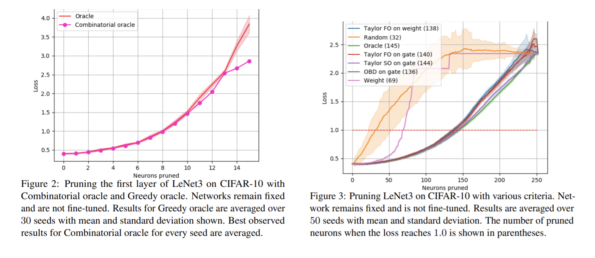
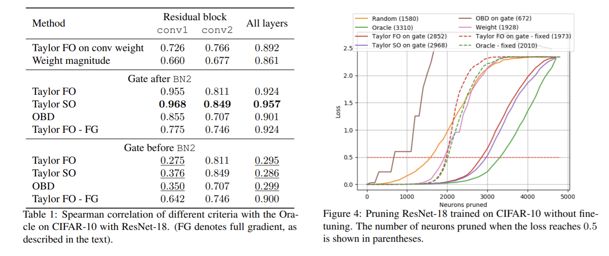
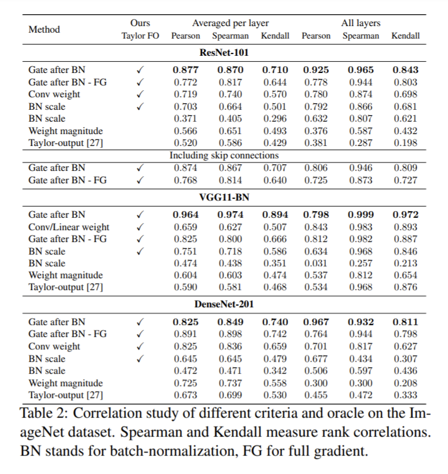
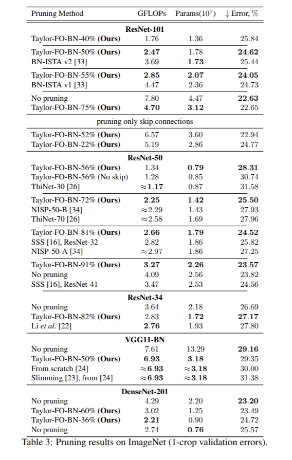
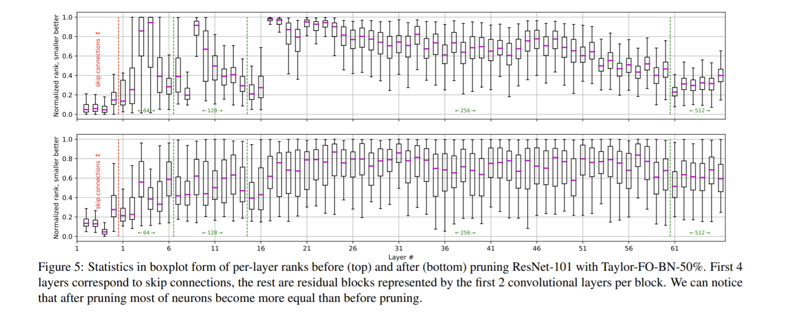

論文網址：\
[Importance Estimation for Neural Network Pruning](https://arxiv.org/pdf/1906.10771.pdf)

### 概述

這篇論文是關於如何減少 model 的參數量，同時也讓 performance 不要掉太多的方法。這個問題也是很實際的問題，因為在很多實際應用的場景上，都會遇到要將 model 縮小的問題，在合理範圍的 performance 代價下，將 model 縮小一點能讓所需要的儲存空間更小，以及縮短運算的時間（更少的參數就間接的代表更少的運算量）。大多先前的 work 都預設了 model 裡面的 weight 大小就代表了該 neuron 的重要性，但實際上不完全是這麼一回事。本篇論文使用的是很基本的概念（應該算基本），但就有很不錯的表現。本篇論文的重點如下：
* 衡量一個 neuron 對 model performance 影響的 criterion（以 Taylor expansion 來近似）
* 大量的實驗結果

### 前情提要

這邊大致上列出 previous work 的一些劣勢之處：
* 假設 weight 的大小就代表了 neuron 的重要性
* 需要額外的 hyperparameter
* 得先自行定義縮小後的 model 架構（knowledge distillation）
* 有太高的 computation cost（greedy method）
* 無法使用於有 skip connection 的架構上（例如：ResNet）

### 內容

#### 計算

有別於以前把 weight 大小當作 neuron 重要性的 criterion 的方法，這篇論文的作者將 criterion 定義成「移除了這個 neuron 之後（移除某一個 parameter），對於 error 的影響大小」。這種定義方法的難處是難以一一的計算移除了每一個 parameter 之後的表現（parameter 有幾個就要做 inference 幾次），所以作者提出了用泰勒展開來近似的方法，因為一階的展開只會需要用到 gradient 的資訊，而對於現有的 deep learning 框架來說是很簡單的事情，所以可以大幅的減少運算的成本。

接下來就是數學的部份，先定義 Error：
$$\min_{\mathbf W} E(\mathcal D, \mathbf W) = \min_{\mathbf W}E(y\mid x, \mathbf W)$$
其中 $\mathcal D$ 是資料集，$\mathbf W$ 就是 network 的參數。

定義第 $m$ 個參數（$w_m$）的重要性如下：
$$\mathcal I_m = \Big( E(\mathcal D, \mathbf W) - E(\mathcal D, \mathbf W \mid w_m = 0) \Big)^2$$
以上的定義其實就是把 $w_m$ 拔掉之後的 error 拿來和本來的 error 比較。但如果我們的 network 總共有 $M$ 個參數的話，就要對 $M$ 個參數都算一次，這對於比較大的 network 是完全不可行的，因此要透過近似來取得以上式子的值。

$$\begin{aligned} \mathcal I_m^{(2)}(\mathbf W) &= \Big( g_mw_m - \frac12 w_m\mathbf H_m\mathbf W_m  \Big)^2 \end{aligned}$$

> 這邊我要特別註明一下，論文中 $\frac12$ 前面是負號，但我想了很久之後還是覺得是加號才對，如果我寫錯的話歡迎留言指正。

> 更新：感謝 robbin242 的指正，的確應該是負號沒錯，而且展開後的 $W$ 應該要是 $W_m$，推導方式就如留言區的圖片

其中 $g_m = \frac{\partial E}{\partial w_m}$，就是 gradient；$H_{i,j} = \frac{\partial ^2 E}{\partial w_i \partial w_j}$，$\mathbf H_m$ 就是第 $m$ 個 row，$\mathbf H$ 就是 Hessian 矩陣。作者將這個近似的方法在後面的實驗裡面稱為 Taylor SO（second order）。但是對於一個很大參數量的 network，它的 Hessian 所需的計算量也非常可觀，因此就有了更簡略的近似：
$$\mathcal I^{(1)}_m(\mathbf W) = \Big( g_mw_m \Big)^2$$
作者在之後的實驗將這種近似方法稱為 Taylor FO（first order）。但是這樣對於單一個參數的重要性來說，還無法使用於某些 network 架構，例如 CNN，要拔掉一個 filter 的話一次就是拔掉那一整個 filter 的參數，所以一個 parameter set $\mathcal S$ 的重要性如下：
$$\mathcal I_{\mathcal S}^{(1)} \equiv \Big( \sum_{s\in\mathcal S} g_sw_s\Big)^2 $$
或是：
$$\mathcal I_{\mathcal S}^{(1)} \equiv \sum_{s\in\mathcal S} \Big(g_sw_s\Big)^2$$
作者將上方的定義方式稱為 *group contribution*，而下方的稱為 *sum of individual contributions*。

為了要計算以上的 importance measurment，作者使用了 gate 接在 network 的每一個參數後面，也就是 $\mathbf z = \mathbf 1^M$。有了 gate 之後，在計算 gradient 的式子裡面就不用出現 $\mathbf W$，可以直接對 gate 算 gradient 來得到一樣的結果。如下：
$$\mathcal I_m^{(1)}(\mathbf z) = \Big( \frac{\partial E}{\partial \mathbf z_m} \Big)^2 = \Big( \sum_{s\in\mathcal S_m} g_sw_s\Big)^2$$
並且對以上的式子作一些操作之後，就可以得到 Fisher information matrix 的表示方法，但我認為這不是本篇論文的重點所以就省略，有興趣的讀者可以參考原論文。

#### 如何 pruning

1. 在一個 minibatch 之中，將每一筆資料都用 model 跑一次，一邊 update 參數，再將所得到的 gradient 平均，來計算 importance 分數（可能是使用 group contribution 或是 sum of individual contributions 的方法來計算）。
2. 在一定數量的 minibatch 之後，將每一個參數的 importance 分數平均之後，再移除若干個 neuron。
3. 重複以上的動作，一邊 finetune，直到指定數目的 neuron 被刪掉，或是 error 已經超過預定可接受的範圍。

這邊列出幾個實作的細節
* 實際計算 Hessian 是非常消耗運算資源的，所以作者使用了 diagonal approximation，但對於 ImageNet 的實驗來說，model 大到就算用近似的也難以計算 Hessian，因此在 ImageNet 上的實驗都是 FO 的版本。
* 除非是使用 gate，否則 importance 的計算都是使用 sum of individual contributions
* 在 prune 掉一些 neuron 之後，finetune nework 會比起沒有 finetune 然後直接繼續 pruning 還要好（可以解釋成 model 需要把任務分配到新結構上的 neuron）
* 作者每一次 prune 掉 2% 左右的 neuron

### 結果與實驗

以下這張圖是作者做的實驗，想要實驗看看 greedy method（每次都選擇最不重要的**一個** neuron prune 掉）和「窮舉所有 pruning 方法（combinatorial oracle）」的表現關係如何，結果發現其實 greedy method 找到的不一定是 global 的最佳解，但是也相差不大，可是以 greedy method 來做的運算速度比窮舉法快了指數倍，而在之後的實驗裡面，greedy method 被稱為 oracle，是作為一個 computationally infeasible 的 performance upper bound。而右邊的部份就是在 CIFAR-10 上 pruning LeNet3 的結果，可以看到其實大家的表現都差不多（OBD 是其他人的 work）。方法名稱後面的括號是 loss 超過 1.0 時 prune 掉的 neuron 數目。

下面這張圖的左邊是計算各種方法算出來的 importance 分數和 oracle 算出來分數的相關係數，可以看到以泰勒二階近似出來的分數和 oracle 的相關係數是最高的。此外作者還測試了將 gate 擺在不同的地方，分別是擺在 batch normalization 之前跟之後，以及用單一一筆資料得到的 gradient 來做計算的結果（FG）。右圖就是他們的表現。雖然 OBD 的相關係數和 oracle 的非常高，但那個相關係數的計算方式是經過平方的，在加上正負號之後，似乎就不是一個好的 importance score。

結果是以 Taylor SO，並且將 gate 擺在 BN 層之後的表現是最好的。作者推論可能是因為 BN 會讓各個 parameter 的重要性重新洗牌，所以在 BN 之前計算 importance 分數的話就會被 BN 再打亂一次。

在 ImageNet 上因為 model 太大了，所以只能做 Taylor FO 的近似，可以看到表現都很好，有些甚至還能用更少的 parameter 來得到更好的 performance。

下面這張圖是觀察 pruning 之後是不是有把比較不重要的 layer 刪掉，並且讓所有 layer 都同等重要。

### Acknowledgement

感謝 robbin242 指出我內文的錯誤
