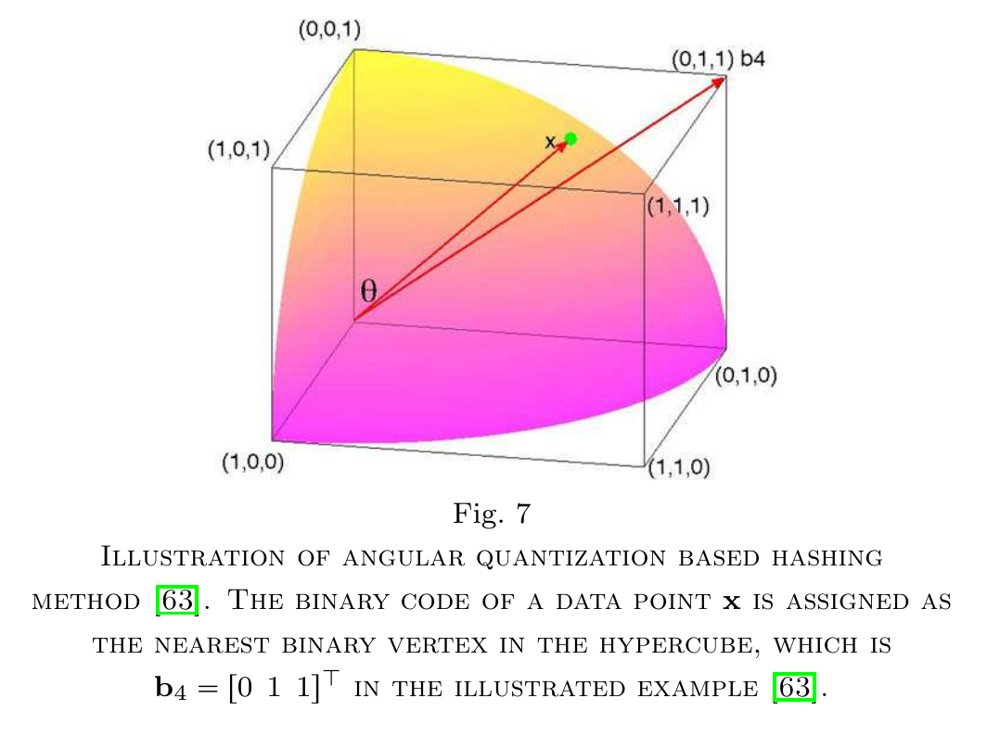

論文網址：\
[Learning to Hash for Indexing Big Data - A Survey](https://arxiv.org/abs/1509.05472)

### 概述

這篇是一篇整理了各種與 hash 相關的方法的 survey。隨著資料量的快速增長，如何在大量的資料裡面搜尋出想要的結果就變成一件很重要的事情。最直觀的一個一個比較的這個作法也變得不可行，因此就需要透過各種 hash 技巧來加速搜尋，同時也不會讓 percision 和 recall 降低。

這篇 survey 整理了從各種面向切入的 hash 技巧，大致的架構如下：
* Hash 的基本架構
* Randomized hashing 的方法
* Learning based 的方法
* Deep learning 的影響
* 進階的 hash 技巧
* Discussion

### 前情提要

小小複習一下 precision 和 recall 的定義：precision 是「找到的結果之中，是正確答案的比例」，而 recall 是「所有正確答案之中，被找到的比例」。
$$\begin{aligned}\text{Precision} &= \frac{\text{True positive}}{\text{True positive } + \text{ False positiive}} \\\\
\text{Recall} &= \frac{\text{True positive}}{\text{True positive } + \text{ False negative}} \end{aligned}$$

### 內容

#### Hash 的基本架構

Hash 的 pipeline 基本上就是選一個 hash function，再把所有資料都經過 hash function 的處理，存放在一個 table 上面（indexing），再建立一個 inverse lookup table，要搜尋的時候就可以將輸入的資料經過 hash function 找到 hash 值，再從 inverse lookup table 裡面找到最接近的搜尋結果。下圖所舉例的搜尋是使用 Hamming distance 作為 distance function：

#### Randomized Hashing Methods

顧名思義就是含有隨機性的 hashing 方法，這類的方法因為實作上相對比較簡單，所以是經常被使用的 hashing 方法。Locality sensitive hashing（LSH）系列的方法就是屬於這類的方法，LSH 的精神就是要讓兩個點落入同一個 bucket 的機率等於他們之間的 similarity：
$$P\{h(\mathbf x_i) = h(\mathbf x_j)\} = sim(\mathbf x_i, \mathbf x_j)$$
也就是說兩個點越像，就越有可能得到一樣的 hash 值。而這類的方法又可以分為兩種 approach，random projection based 以及 random permutation based。\
而因為是 randomized based，所以這類的方法都是 data-independent 的，也就是和目標的資料分佈完全無關。

---

**Random projection based**
$$h_k(x) = \text{sign}(\mathbf w_k^T\mathbf x + b_k)$$
其中 $\mathbf w_k$ 和 $b_k$ 都是從高斯分布隨機產生的權重。

使用這種方法要得到好的 precision 必須要有夠長的 hash code；而要得到好的 recall 需要有夠多 hash table（也就是有夠多的 hash function），所以這種方法的瓶頸就在於增加 precision 和 recall 的同時，會增加 hash code 長度和 hash table 數量，使得效率逐漸降低（無論是空間效率或是時間效率都會降低）。當然也有改進版本的一些作法，在這邊就不列出來了，可以參考論文中的細節。

---

**Random permutation based**\
這類方法之中最有名的就是 MinHash 了，這個 hash 方法是用來近似 Jaccard similarity 的，Jaccard similarity 定義如下：
$$J(\mathcal S_i, \mathcal S_j) = \frac{\mathcal S_i \cap \mathcal S_j}{\mathcal S_i \cup \mathcal S_j}$$
而 MinHash 的作法是將所有元素（$\cup \mathcal S_i$）做 $k$ 次隨機的排列，並以每一次排列中 permutation 數字最小的作為 hash code 的第 $k$ 個數字（$c_{\pi_k(d)}=1$ 代表 $\mathcal S$ 裡面有 $\pi_k(d)$ 這個元素）：
$$h_k(\mathcal S_i) = \min_{d\in \{1,\cdots,D\}, c_{\pi_k(d)_i=1}} \pi_k(d)$$
並且相同的東西也可以推廣到 vector 上，不只是可以使用在 set 上：
$$J(\mathbf x_i, \mathbf x_j) = \frac{\sum_{d=1}^D \min(x_{id}, x_{jd})}{\sum_{d=1}^D\max(x_{id}, x_{jd})}$$
和 LSH 相比，MinHash 所產出的 hash code 不只是 binary 的，所以可以再推廣到連續的 case 上。

在實務上，MinHash 的作法對於高維而且 sparse 的 vector 非常有用（例如 bag of words）。同樣的也有一些其他 variation 的作法，就不列出來了。

#### Learning Based Methods

和 randomized hashing 方法相比雖然比較複雜，但是 randomized 的方法是 data-independent 的，以下列出幾個 learning based 方法的屬性：
* unsupervised, supervised, semi-supervised
* pointwise, pairwise, triplet-wise, list-wise
* linear, non-linear
* single-shot learning, multiple-shot learning
* non-weighted, weighted

**unsupervised, supervised, semi-supervised**\
差別是在有沒有把資料的 label 也拿去 learn 一個 hash function。

**pointwise, pairwise, triplet-wise, list-wise**\
這個類別是有 label 的方法才有的。pointwise 是只有觀察單一個 instance 的 hash function；pairwise 是只考慮一組點對之間是不是 similar 的，所以不會考慮到 ranking 的資訊；triplet-wise 是會考慮到目標點 $q$ 和 $x_1$ 以及 $x_2$ 的關係，一次考慮三個點之間的關係（$sim(q, x_1)$ 和 $sim(q, x_2)$ 之間的關係）；list-wise 就是使用三個以上的 instance，再化成很多個 triplet-wise 的 similarity。

**linear, non-linear**\
linear 的好處是相對比較簡單，但是有時候會有點弱，透過 non-linear 的轉換（例如 kernel 轉換）就能讓 hash function 更具 discriminative power。

**single-shot learning, multiple-shot learning**\
single-shot 的方法是一次直接學出一組 hash function；而 multiple-shot learning 的作法是分很多次學出一組 hash function，每一次要產生新的 hash function 的時候，都會考慮前面所有 hash function 所產生的 bias，通常是以 semi-supervised 或是 supervised 的方法來做，因為透過 label 可以比較容易知道之前生成的 hash function 的 bias。

**non-weighted, weighted**\
差別是在計算 similarity 的時候，對於每一個 hash code bit 有沒有加上權重。

---

以下介紹幾個 learning based 的 hash function：
* spectral hashing
* anchor graph hashing
* angular quantization hashing
* binary reconstructive hashing
* metric learning hashing
* semi-supervised hashing
* column generation hashing
* listwise hashing
* circulant binary embedding

以下的討論會比較 high level，想了解細節的話可以參考論文中的 reference。

**spectral hashing**\
這種 hash 方法的目標是做出每一個 hash bit 之間的相關係數都是 0 的 hash code。但因為原本的 constraint 太強，會讓這個問題變成 NP Hard 的問題，所以就必須假設 data distribution 是 uniform 的，然後再使用 cos 函數來對 PCA 方向上的角度作 hashing。可是這種 orthogonal projection based 的方法都會隨著 hash code 的長度增加，而產生出一些不好的 hash code（因為有代表意義的維度都被用過的緣故），所以可以使用 kernel function 來減輕這個問題的影響。但最大的缺點還是對於 uniform data distribution 的假設，這個假設在現實生活中很少會成立。

**anchor graph hashing**\
目標和 spectral hashing 很像，只是把 uniform data distribution 的假設拿掉。方法是令一些 anchor points，並將計算 point to point 的 similarity function 換成 point to **anchor point**，就能做的比 spectral hashing 還要好。

**angular quantization hashing**\
這個方法運用了 similarity 經常等同於兩個 vector 之間的夾角的直覺，所以將 vector 投影到 binary 的 vector 上。也可以先用一個 rotation matrix 先將本來的 data 旋轉到新的空間，同時保留 data 之間的 similarity 之後再 quantize。

**binary reconstructive hashing**\
這個方法的目標是要 minimize 原本 data 的距離和 hash code 之間的差距。也可以加入 supervised 的元素，將同一個 label 的 data 之間的距離設為 0，不同 label 的 data 距離設為一個很大的數字。

**metric learning hashing**\
這個方法是先學出一個 metric，之後再用 randomized hash function 來得到 hash code。因為學出來的 metric 會把 data 投影到 discriminative 的 feature space，所以理論上效果會比單純的 randomized hash 還要好。

**semi-supervised hashing**\
這個方法利用了 pairwise 的 similarity 來生成 hash code。

**column generation hashing**\
與 semi-supervised hashing 不同的地方是在它考慮的是 triplet 的 similarity。

**listwise hashing**\
與 column generation hashing 不同之處是他考慮 query point 和所有 data 之間的 similarity，並且 ranking。

**circulant binary embedding**\
因為大部分的 hash function 都是線性的，但並不是所有 data 都是線性能好好分割的，所以這個方法是用非線性的投影來 hash。

#### Deep Learning for Hashing

以下簡短的介紹幾個 deep learning based 的 hash 方法：
* semantic hashing
* tailored feed-forward neural network
* deep hashing
* supervised deep hashing
* convolutional neural network hashing
* deep semantic ranking hashing
* deep neural network hashing

**semantic hashing**\
這個方法是用 restricted boltzmann machine 疊出來的，是一個 deep generative model。並且可以以 hash code 作為儲存在記憶體上的位址，可以加速 nearest neighbor 搜尋的速度。

**tailored feed-forward neural network**\
目標是要解決比較長的 hash code 經常會使 recall 比較低的問題，想法是透過 pairwise 的資訊來讓學到的 hash code 比較 sparse。

**deep hashing**\
這個 network 是將圖片作非線性轉換之後得到 compact hash code，使得 hash code 的 reconstruction error 要最小（從 hash code 反推回去成圖片和原圖的差別要最小）、hash bit 之間是 independent 的。

**supervised deep hashing**\
在目標函數裡面加上一個 discriminative term 之後 train 的 model。

**convolutional neural network hashing**\
第一個不是使用 hand-crafted feature 作為輸入的方法，因為如果仰賴於 hand-crafted feature 的話，feature 的 discriminative power 就非常重要。但是直接用 CNN 學出來的東西就不需要 hand-crafted feature。

**deep semantic ranking hashing**\
把 ranking 的元素加到 training 裡面。

**deep neural network hashing**\
把圖片的 triplet similarity 關係加入。因為用了比較深的 model，所以在表現上比前面幾個方法要來的好。

---

deep learning 的方法雖然有效，但是僅限於將速度排除在外的情況之下。可是 hashing 的速度非常重要，因此使用比較簡單的方法也是有它的好處在。也因此，如何加速 deep neural network 的這個問題也對 hashing 至關重要。

#### 進階的 hash 技巧

以下簡短的介紹幾個特殊的 hash 技巧：
* hyperplane hashing
* subspace hashing
* multi-modality hashing

**hyperplane hashing**\
這種的 hashing 的 query 是一個 hyperplane，所要找出的目標是距離 query hyperplane 最近的點。其實可以想成跟 hyperplane 的法向量越垂直的點就是越接近 hyperplane 的點。

**subspace hashing**\
在電腦視覺等等的領域中，會用到 subspace representation，例如人臉辨識，同一張臉的不同角度的 feature vector 張出的 subspace 應該要是非常接近的。因此要在很多個 subspace 裡面找到最近的 subspace 就變成了重要的問題。

**multi-modality hashing**\
大多數的 hash function 都是針對 single modality 的資料，但一些很重要的應用卻是 multi-modality 的，例如網頁，就可能包含了文字和圖片。除了最 naive 的把不同 modality 的 hash code 串在一起之外，還有其他更好的作法

#### Discussion and Open Issues

* learning based 的方法大多缺少了理論上的保證，理論上的保證大多數都是對於 randomized hash function 的。
* 如果說大量的資料有辦法用 compact hash code 來表示，那麼我們能夠使用 hash code 來取代原本的 data 來做機器學習上的應用嗎？
* 現在大多數的 hash code 還是有所謂的 semantic gap，也就是缺少了 semantic meaning。

### 結語

這篇論文很詳細的整理了有關 hash function 的各種知識以及 previous works，也列出了幾個 future work 的方向。但有個小小的缺點是，中間的 hash function 的 notation 中的下標 $i,j$ 有幾個地方寫的不太對，要稍微注意一下。
