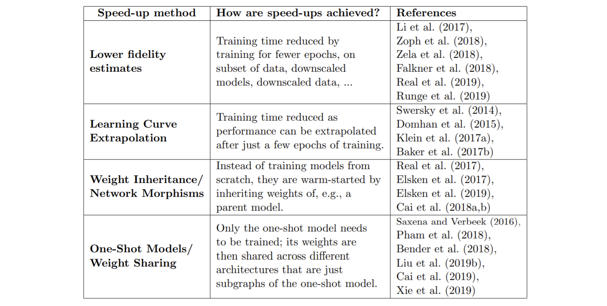

論文網址：\
[Neural Architecture Search: a Survey](https://arxiv.org/abs/1808.05377)

### 概述

這篇論文是關於 neural architecture search（NAS）的 survey。隨著 deep learning 的力量被大家所發現之後，要如何找出一個有效率的 deep neural architecture 就變成了一個研究方向。這是一篇 2019 的論文，所以內容沒有辦法涵蓋到最新的部份，不過對於要了解基本的 NAS 已經很充足了。

### 內容

下圖是簡單的 NAS 架構，可以看到主要被分為三個部份：
1. search space
2. search strategy
3. performance estimation strategy

以下將會分別介紹每一個部份的內容。

#### Search Space

在 search space 的部份，所要做的事情是將 neural architecture 用結構化的方式表示。主要可以分為四種 approach：
1. chain-structured\
最直觀的一種 network 結構，就是直直的一條（下圖的左邊），這樣的結構有三個變因可以操作：network 的深度、layer 的操作、layer 的 hyperparameters。想當然爾，這樣的結構所能生出來的 network 架構是非常侷限的，因此就有了更複雜的結構：multi-branched network。
2. multi-branched network\
是將 chain-structured 變為比較複雜的形式，也就是將 network 的 input / output 改成不必由上而下的循序關係（下圖的右邊）。

3. cell-based（micro-architecture）\
這種方法是將 search 的目標換成一個比較小的單位（cell）。而這種方法有以下幾個優點：search space 的大小變得比較小，因為我們要搜尋的 architecture 是比較小的單位；這種方法搜尋出來的結構比較容易能夠被使用在 model 裡（以 cell 來取代 model 的某些結構）；使用重複性的結構是能夠表現很好的（現今不少表現好的 neural network 都是將很類似的結構接在一起）。

4. macro-architecture\
隨著 cell-based 方法的出現，也就出現「如何將 cell 以比較有效率的方式接起來」的問題。在理想上，micro-architecture 和 macro-architecture 應該要同時優化，否則只優化 cell 的話，用手動設計的 marco-architecture 就有降低 performance 的潛在疑慮。

#### Search Strategy

有很多種 approach 可以做 search，包含：random search、Bayesian optimization、evolutionary methods、reinforcement learning。以下將一一介紹上述的方法。
1. Bayesian optimization\
這個方法是比較老牌的方法，從 2013 年開始就有一些 work。Bayesian optimization 的基本概念是透過 sampling 來優化對於一個未知函數的了解，進而求出我們目標函數的最大值：
$f$ defined on $\mathcal X$ is the performance on evaluation set, where $\mathcal X$ is the neural architecture space, and the objective is $\max_{x\in \mathcal X} f(x)$
至於實作的細節就不在此說明了，有興趣的讀者可以自行查詢。這個方法主要是被使用在 image 相關的 task 上，也在 2016 年第一次在比賽中成功超越 hand-crafted network。

2. reinforcement learning（RL）\
RL 的基本概念就是透過一個 agent 來從 search space 裡面挑出 network architecture，再透過 evaluation 之後的表現來當作 reward，如此循環下去就會使得 agent 比較懂得如何挑好的 network architecture 才會有好的表現。

3. sequential decision process\
這個想法是將生成 architecture 的過程變成循序漸進的模式，先生成第一個 layer，再決定第二個 layer 要放什麼樣的 layer，以此類推。

4. neuro-evolutionary approach\
這個 approach 是用 evolutionary algorithm 對 model 的結構做優化。原本在 evolutionary algorithm 裡面的 mutation 在 NAS 裡就是 model 局部結構的改變，例如增減層數或者改變 layer 的 operation。在 training offspring 之後，就會被加到 population 裡面，進行下一個 generation 的生成。而 neuro-evolutionary 和一般的 evolutionary algorithm 不同之處在於 sample parent 的方法、更新 population 的方法等等的，不過在概念上還是大同小異，只是多了一些比較特別的操作。

總結以上的內容，以結果來看的話，RL、evolutionary 和 random 三者的比較是：RL 和 evolutionary 的方法在最終結果上的表現差不多，都比 random 的還要好，但是 evolutionary 在 training 過程的表現比較好、比較穩定，並且產出的 model 也比較 compact。

#### Performance Estimation Strategy

在這個部份的是如何 evaluate sample 出來的 model 的表現。最直觀來看的話，就是將 sample 出來的 model 丟下去 train，再看結果來比較好壞。但是這樣的問題是運算資源以及時間成本都非常的高，因此不是一個 generally 可行的方案。下表是目前可行方法的列表，以下將簡單的介紹那些方法所代表的意義：

1. lower fidelity estimate\
顧名思義就是用成本比較低，但是又能和 performance 有關的 metric 來評分。例如：train 在資料的一個 subset、用低解析度的圖片來訓練。雖然用比較簡略的方法來 training 可能有辦法代表部份的表現，但實際上還是不一定有足夠的代表性。並且有一個 work 發現了近似所得到的 model performance 和完整版的 evaluation（把所有資料拿下去訓練）所得到的是有一段差距的（model 的相對排名不太一樣）。

2. learning curve extrapolation\
從 learning curve 可以某種程度上的預測之後的表現，這樣做的假設是一開始做的好的 model 在之後也會比較好，如此一來就不用做完整的訓練，只要做一部份的就能猜出後面的表現。也有一個方法是有點相似的概念，是訓練一個能夠以 network architecture 預測表現的 model，這樣的預測可以某種程度上知道某個 cell 或是 architecture 的效益，進而預測沒有看過的 model 表現如何（雖然沒有看過，但是和看過的 model 有某種關係）。

3. weight inheritance / network morphism\
network morphism 的概念是將已經訓練好的 model 的 weight，拿去給不同 architecture 的 model 來用（簡單來說是這樣，但事實上是有嚴格的定義的，[參考](https://arxiv.org/abs/1603.01670)）。這樣做的好處是可以讓大大減少 training 的過程，因為已經是訓練好的 weight 了。但壞處是嚴格定義上的 network morphism 會讓 network architecture 越來越大，如果用 approximate network morphism 的話，就比較不會有這個問題。

4. one-shot model / weight sharing\
one-shot 的想法是訓練一個超大的 model（被稱為 supernet），再用訓練好的 weight 來測試不同 architecture 的表現。在訓練好 supernet 之後，就可以在現有的 weight 上來嘗試各種不同的 architecture，雖然這樣做會讓好 model 的 performance 被低估，但只要在 ranking 上的相對關係是不變的，就是有效的 metric。這種方法的壞處是 search space 被限縮在 supernet 的 subnet 之中，也可能使得 subnet 的結構會讓 searching 有 bias（如果一個 supernet 裡面出現了比較多的某種 substructure，那麼 search 就很可能是偏向該結構的）。然而也有 work 質疑這樣 ranking 是不是正確的（[參考1](http://proceedings.mlr.press/v80/bender18a/bender18a.pdf)、[參考2](https://arxiv.org/abs/1902.08142)），只能說這還是相對新的領域，還有待研究的問題。

下圖是 one-shot architecture search 的概念圖。

### Future Directions

* 目前的 work 比較多是針對 image 相關的 task，未來可以將方向拓展到其他領域中（例如：GAN）
* 往 multi-task 方向的研究，在意義上 multi-task 要使用的和 NAS 是一樣的，都是最精簡但卻有好表現的 network
* 目前的 work 都是針對已經有的 building block 來做的（例如：convolution、pooling 等等的），未來希望可以突破這個限制
* 目前很多 work 都是以 CIFAR-10 上的 performance 來作為 performance evaluataion 的根據，但應該需要一個另外的 public benchmark 來讓大家有統一的標準

### References

* [NAS 的基本介紹（medium）](https://medium.com/ai-academy-taiwan/%E6%8F%90%E7%85%89%E5%86%8D%E6%8F%90%E7%85%89%E6%BF%83%E7%B8%AE%E5%86%8D%E6%BF%83%E7%B8%AE-neural-architecture-search-%E4%BB%8B%E7%B4%B9-ef366ffdc818)
* https://arxiv.org/abs/1603.01670
* http://proceedings.mlr.press/v80/bender18a/bender18a.pdf
* https://arxiv.org/abs/1902.08142
