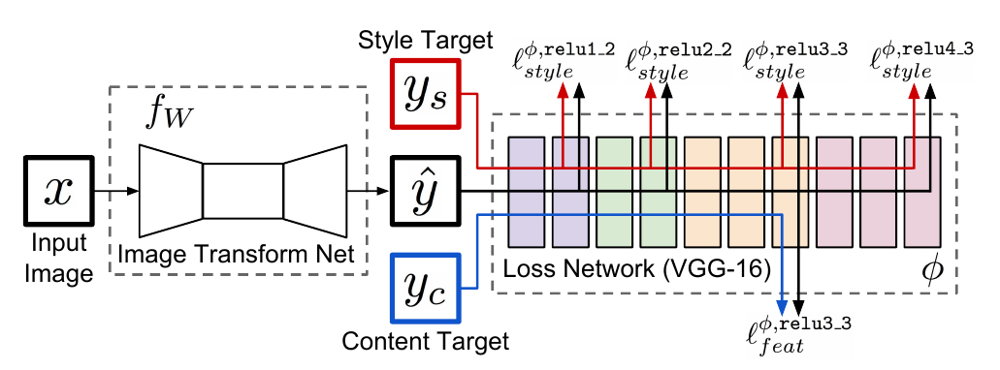
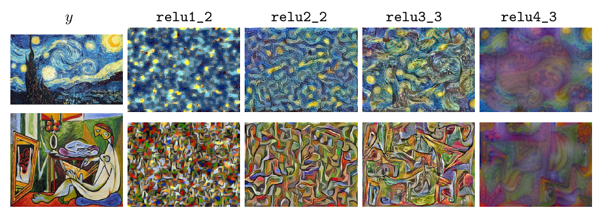
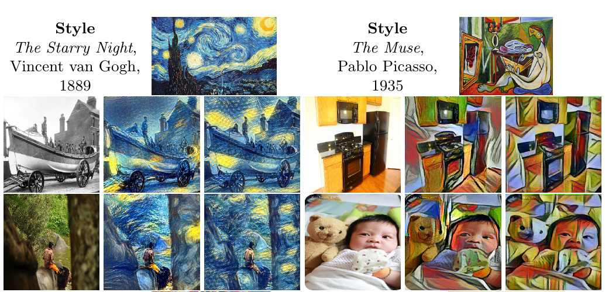
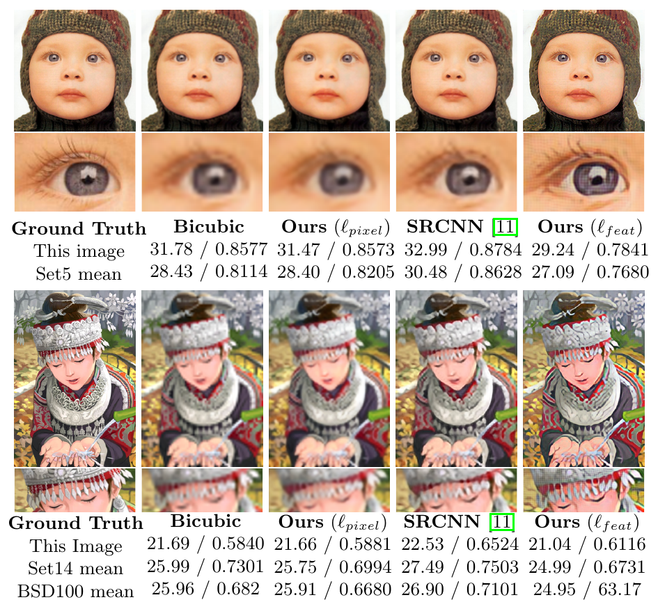

（這是第一篇看論文的筆記，希望以後可以有更多篇類似的筆記。以下的內容如有冒犯之處，敬請來信告知。）

### 概述

這篇論文[^1]是在感知運算課程中的推薦閱讀，內容講的是使用 CNN 來做 style transfer 和 super-resolution。在 style transfer 方面，不同於以往[^2]的做法（這篇論文以該篇 paper 為 baseline），是使用 optimization-based 的方法來最小化他們所提出的 perceptual loss function（下方會詳述），而其他 CNN-based 的方法通常都是使用 per-pixel loss（比較每一個 pixel 的差異值再加總），因此這篇論文的厲害之處就是將兩種方法結合在一起，使用 CNN 和 perceptual loss function 來做 style transfer。至於 super-resolution 的部份也是用類似的方法，差別就是在 training 階段時 input 有所不同而已。

### 方法

#### 1. 架構

輸入圖片是 $x$，前面的 $f_W$ 就是負責將 $x$ 轉變成輸出 $\hat y$ 的 CNN，而後面的 Loss Network 其實就是一個 classification 的 CNN，在這邊他們和 baseline[^2]一樣，採用 VGG Net，只是他們將其用於取出圖片的 feature，所以可以看到上圖顯示了從該 CNN 的中間就把 feature 取出，來算 perceptual loss。可以看到他們取出了不同種的 loss，$\ell_{style}^{\phi}$ 代表的是 style feature 的 loss，也就是說各種 texture、color 等等的 feature；而 $\ell^{\phi}_{feat}$ 代表的是圖片中那些物品的 spatial structure（可以說是構圖），將兩個加起來其實就是要 train 出一張構圖和 $y_c$ 類似，但是 style 和 $y_s$ 也要類似的圖。以及在 training 階段，對於兩種不同目標，$y_s$ 與 $y_c$ 就有不同的意義：
* Style transfer：
    * $x:$ 輸入圖片
    * $y_c:$ 和 $x$ 一樣，為了確保輸出的圖片構圖與輸入一樣
    * $y_s:$ 想要轉變成的 style 圖片
* Super-resolution：
    * $x:$ 輸入圖片（低解析度的圖片）
    * $y_c:$ 輸入圖片的高解析版（ground-truth）
    * （$y_s$ 不需要使用）

至於詳細的 Image transform net 的結構，可以參考[這篇論文](https://cs.stanford.edu/people/jcjohns/papers/fast-style/fast-style-supp.pdf)[^3]，大致上使用了一些 residual 的結構。

#### 2. Loss Functions

以上的兩張圖片是將各個 relu 層的 feature 拿來重建原圖的結果（詳情可以參考[這篇論文](https://arxiv.org/abs/1412.0035)[^4]），可以發現到在 feature loss 那張圖裡面，越後面的層越難重建原本圖片的構圖（最終他們是使用 $\texttt{relu3_3}$ 的 feature 來用）。在 style loss 方面，則可以看出在越前面的層，就是取得越小的、越局部的 feature，越到後面就是越大範圍的 feature（最終他們四層的 feature 都使用了）。而他們的詳細的定義如下（以下數學式的來源均為原論文）：

feature loss：

$$\ell_{feat}^{\phi,j}(\hat y , y) = \frac{1}{C_jH_jW_j} \| \phi_j(\hat y) - \phi_j(y) \|_2^2$$

其中 $j$ 是 loss network 的層數，$C_j$ 是該層的 channel 數，$H_j, W_j$ 是該層的高、寬，其實簡單來說就是把 $\hat y$ 和 $y$ 在該層的每一個 pixel 相減之後取 $L2$-norm 的平方，再 normalize（除以 $C_jH_jW_j$ 的部份）。

style loss：\
style loss 的定義看起來比較複雜，但是實際上沒有看起來那麼複雜。先定義一個 $C_j \times C_j$ 的 Gram matrix：

$$G^{\phi}_j(x)_{c,c'} = \frac1{C_jH_jW_j}\sum_{h=1}^{H_j}\sum_{w=1}^{W_j}\phi_j(x)_{h,w,c}\phi_j(x)_{h,w,c'}$$

再定義 style loss：

$$\ell^{\phi, j}_{style}(\hat y, y) = \| G_j^\phi(\hat y) - G_j^\phi(y) \|^2_F$$

其中 $\| \cdot \|_F$ 是 Frobenius norm：

$$\| A \|_F = \sqrt{\sum_{i=1}^m\sum_{j=1}^n | a_{ij} |^2}$$

$G_j^\phi(y)$ 其實就是類似把 channel 和 channel 之間做內積的矩陣，因此可以反映出 channel 之間的關係（值越大代表他們越相關）；再把後面的 Frobenius norm 和前面的結果合在一起看的話，就可以發現這依然是在比較兩種圖片的 low level 到 high level feature 的差異。

total variation loss：（以下定義參考 [^4]）\

$$\ell_{TV}(x) = \sum _{i,j}\sqrt{(x_{i, j+1} - x_{ij})^2 + (x_{i+1,j} - x_{ij})^2}$$

將以上的結果合併：

$$\hat y = \arg \min_y \lambda _c \ell^{\phi,j} _{feat}(y,y_c) + \lambda _s\ell^{\phi, J} _{style}(y,y_s) + \lambda _{TV}\ell  _{TV}(y)$$
其中 style loss 的上標 $J$ 是指將所有指定的 layer 的 loss 都加起來。這個 loss function 是和 baseline[^2] 的所 minimize 的是同樣的式子。

#### 3. Evaluation

![他們的結果與 baseline[^2] 的結果比較（來源：原論文）](performance.png)

可以看到他們的 CNN approach 其實能夠做到跟 50~100 次 optimization iteration 差不多的 loss，而速度上快蠻多的，單就一張圖片的 style transfer 可以快到 1000 倍以上（1024 $\times$ 1024 的圖片需要大概 0.21 秒）！但是我認為這兩個 approach 其實不應該以這個標準來比較，因為一個是使用預先訓練好的 CNN 來做出 $\hat y$，而另一個是直接對於圖片解最佳化問題，本篇 paper 對於每一種 style 都必須要 train 一個 model，所以如果加上 training 的時間，做出單一 output 的時間其實是 baseline[^2] 比較快。

### 結果

可以看到他們的結果都做的不錯，在 style transfer 的部份，中間的圖片是 baseline[^2] 做出的結果，以結果來看的話比較難以評斷好壞，但顯然本篇 paper 的作法看起來是有作用的。另外在 super resolution 的部份其實算是蠻成功的雕出看起來合理且清楚的線條，並有一種用畫的畫出來的感覺。

### Insights, Strengths and Weaknesses

* Insights：
    * 有別於以往的 per-pixel loss，這篇 paper 改成使用 perceptual loss，獲得了很好的結果
    * 與之前的 optimization-based 方法不同，使用了 CNN 的架構來達成目標
* Strengths：
    * 因為只要 train 好 model 之後，轉換的工作就能在一秒達成，所以有用於 real-time video 的 style transfer 的可能性
* Weaknesses：
    * 對於每一個 style 都要 train 一個 model，沒有一個 general 的 model 來 transfer 各種 style
        * 不過其實 training process 也不會到很久，使用 GTX Titan X 需要約四個小時

[^1]: [Perceptual Losses for Real-Time Style Transfer and Super-Resolution](https://arxiv.org/abs/1603.08155)
[^2]: [A neural algorithm of artistic style.](https://arxiv.org/abs/1508.06576)
[^3]: [Perceptual Losses for Real-Time Style Transfer and Super-Resolution: Supplementary Material](https://cs.stanford.edu/people/jcjohns/papers/fast-style/fast-style-supp.pdf)
[^4]: [Understanding Deep Image Representations by Inverting Them](https://arxiv.org/abs/1412.0035)
