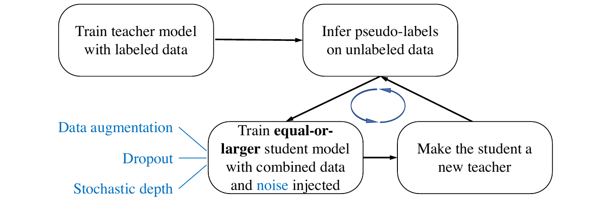
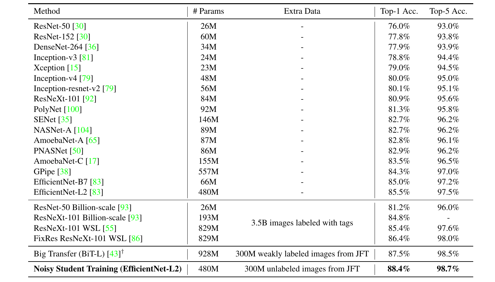
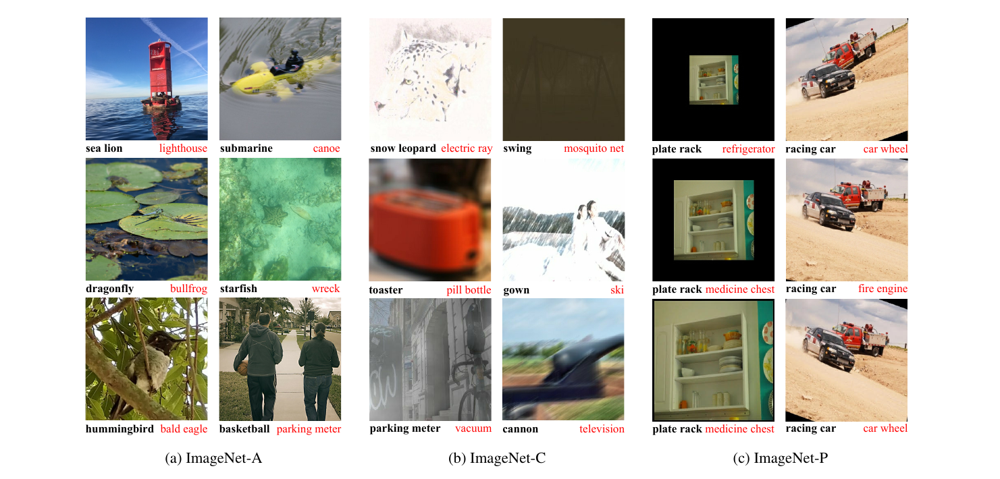

論文網址：[Self-training with Noisy Student improves ImageNet classification](https://arxiv.org/abs/1911.04252)

### 概述

這篇論文提出了一個新的 semi-supervised learning 方法，他們命名為「Noisy Student Training」，顧名思義就是將含有 noise 的東西給一個像是學生一樣的 model 去學。因為過去的方法大多都是依靠著大量有 label 的資料來訓練，所以就忽略了大量 unlabeled 的資料所帶來的可能性。其實 Noisy Student Training 的概略步驟如下，看起來沒有到很複雜，不過其中也是隱藏了很多細節值得我們借鏡：
1. 訓練一個 teacher model
2. 用訓練好的 teacher model 來對一些 unlabeled 的資料上 label
3. 用一個「模型複雜度大於等於 teacher model」的 student model 來學，但不同的地方是 student model 學的是有 noise 的資料
4. student model 學完之後就讓他當下一個 student model 的老師，如此循環下去

### 方法

Noisy Student Training 的重點主要分成兩個部份，「老師和學生的訓練」以及「Noise」。

#### 1. 老師和學生的訓練

上面那一張圖非常清楚的說明了老師和學生的機制是如何運作的，用數學表示的細節如下：

我們現在有 label 過的圖片 $\{(x_1, y_1), (x_2, y_2),\cdots,(x_n, y_n)\}$ 和沒有 label 過的圖片 $\{\tilde x_1, \tilde x_2, \cdots, \tilde x_m\}$
1. 訓練一個 teacher model $\theta^t_*$ 來最小化以下的 loss：$$\frac 1n \sum_{i=1}^n \ell(y_i, f(x_i, \theta^t))$$
2. 用 teacher model 幫還沒 label 的圖片做 label（論文裡面是叫做 pseudo label）：$$\tilde y_i = f(\tilde x_i, \theta^t_*),\ \ \forall i = 1,\cdots, m$$
3. 再訓練一個**大於等於** teacher model 的 student model $\theta^s_*$ 來最小化以下的 loss（其實就是把老師學過的東西加上老師額外給的有 noise 的 loss 加起來）：$$\frac 1n \sum_{i=1}^n\ell(y_i, f^{noised}(x_i, \theta^s)) + \frac 1m \sum_{i=1}^m\ell (\tilde y_i, f^{noised}(\tilde x_i, \theta^s))$$
4. 訓練完的 student 就去當下一個 student model 的 teacher model，如此循環下去

上方所使用的 loss function 都是 cross entropy loss，並且 teacher model 在給 label 的時候有兩種給法，一種是「soft label」，就是給一個 label 的機率分佈；另一種是「hard label」，就是直接給出確切答案的 label 方式。（論文的實驗中，soft labeling 有比較好的 robustness）

在這篇論文中，為了要有夠多的 model 參數來學 unlabeled data，因此作者們選擇了 [EfficientNet](https://arxiv.org/abs/1905.11946) 作為本篇論文使用的 model。

#### 2. Noise

給 student model 訓練的 noise 也分為兩種，一種是在輸入資料的雜訊，另一種是在 model 裡面的 noise。

* 輸入的 noise：
  Data augmentation （[RandAugment](https://arxiv.org/abs/1909.13719)）
* model 的 noise：
  Dropout、stochastic depth（簡單來說是在訓練過程隨機的把某一些隱藏層拔掉，[論文](https://arxiv.org/abs/1603.09382)）

#### 3. 其他細節

* Data filtering, data balancing
  在 teacher model label「unlabeled 圖片」的時候，要給 student model 訓練的會是 confidence score 大於 $0.3$ 的圖片，並且對於那些數量不足平均數量的類別，取用 confidence score 最大的圖片來 duplicate。

### 結果

詳見上方表格。和其他 model 相比，無論是在 top-1 或是 top-5 的 accuracy 上，都是最高的。而在論文附錄中的 ablation study 也實驗出了表現的提升（從原本的 85.0% 到 88.4%，+3.4%），主要的提升原因是此篇論文提出的 Noisy Student Training 所帶來的影響（+2.9%）。至於其他的 ablation study 細節請看[論文的附錄](https://arxiv.org/abs/1911.04252)。

此篇論文很貼心的把 findings 列在 **section 4.3**，有興趣的讀者可以去看看，在這邊就不一一列出了。

以下這些圖片的左下角是經過 Noisy Student Training 過後的 EfficientNet，右下角的是本來的 EfficientNet 所預測的結果，可以看到很多原本都無法被辨別的圖片經由 Noisy Student Training 就變得可以辨別出來（其中有幾張圖片甚至是我覺得我都沒辦法分辨出來的圖片qq），可見這個方法訓練出的 model 對於 noise 的 robustness 非常強。

### Insights, Strengths, and Weaknesses

* Insights：
    * 整合了 self-training、semi-supervised learning 和 knowledge distillation 三個概念的訓練方法
    * 使用 noise 來幫助訓練
    * student model 大於等於 teacher model 使得 student 可以更好的學習額外的 noises
* Strengths
    * 以這種方法訓練的話就可以避免掉大量 labeled data 的需求
    * model 的 robustness 非常強大
* Weaknesses
    * 需要大量的 unlabeled data
    * 消耗的運算資源和時間太過於龐大（在很猛的 TPU 上面訓練了 6 天），使得難以複製或改動他們的實驗結果

### Other References

* https://blog.csdn.net/weixin_37179744/article/details/103100544
