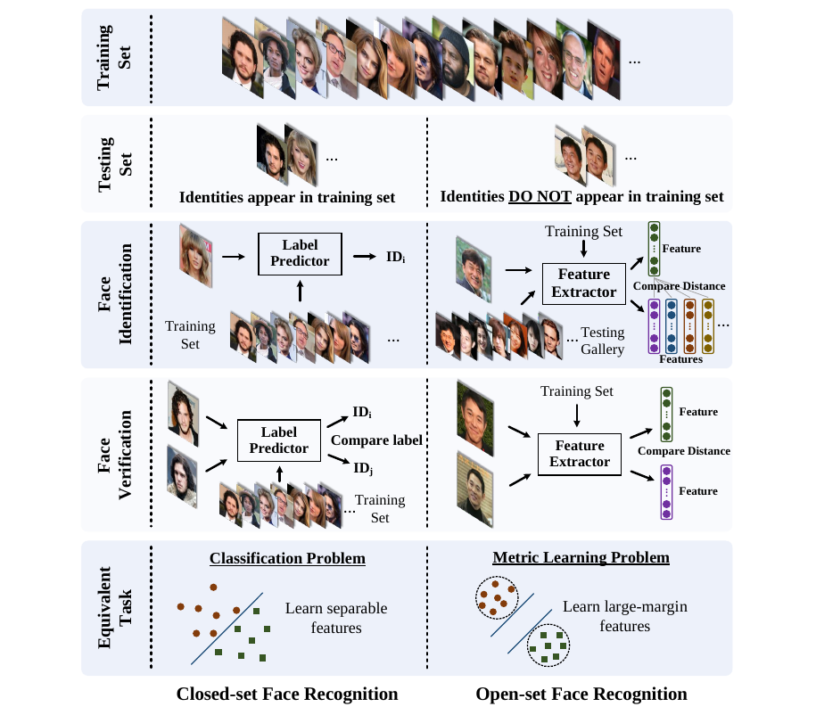
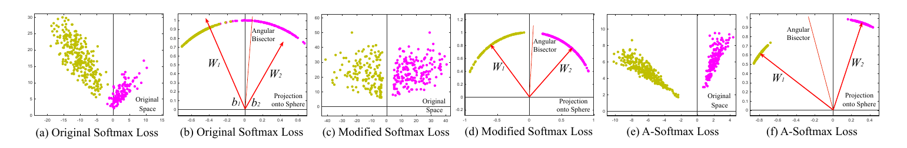
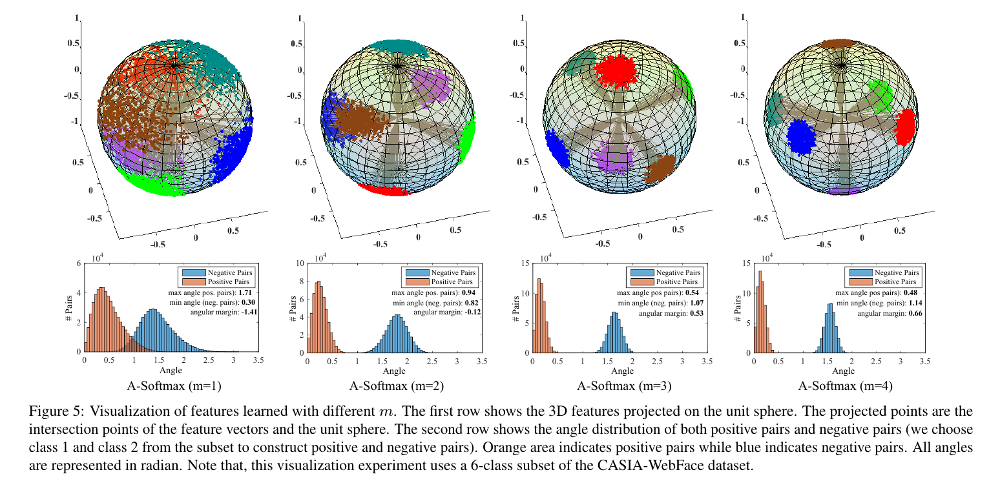

論文網址：\
[SphereFace: Deep Hypersphere Embedding for Face Recognition](https://arxiv.org/abs/1704.08063)

### 概述

這篇論文要解決的問題是人臉辨識的問題。以往的人臉辨識問題大多都是使用 softmax loss 當作 loss function，而為了 performance 的提升，也有其他改造 softmax loss 的方式（請參考論文 related work 中的 deep face recognition 區塊）。本篇論文觀察到了臉部特徵的 feature space 的分布和角度有強烈的關聯性，因此就提出了將 softmax loss 和角度結合的「A-softmax loss」，能在 open-set 的臉部辨識問題有很好的表現。

### 前情提要

這個小節會分享一些我從論文學習到的新的先備知識以及複習：

#### Closed-set vs Open-set

Closed-set 所指的是 training set 和 testing set 中的資料是重疊的，也就是說所有在 testing set 出現的臉在 training set 裡面都有看過；而 Open-set 所指的是在 testing set 裡面出現的人臉在 training set 裡面都**沒有**出現過，因此問題的本質就和 closed-set 的有所不同，以下有一個圖片整理他們的異同處：在 face recognition 的部份，closed-set 所要做的事情是在 training set 裡面找出一個一樣的人，而 open-set 所要做的事情是在給定的 test gallery 裡面找出一個一樣的人（或是不在 test gallery 裡面）；在 face verification 的部份，closed-set 所要做的事情是分辨出兩張臉的 id 並比較他們是否不同，而 open-set 所做的事情是分別取出兩張臉的 feature 再決定他們是否為一樣的臉；在問題的分類上，open-set 的問題比較接近是 metric learning，也就是學出一個能夠儘可能分辨不同 instance 的 feature（同一個 class 在 latent space 之中要儘量的集中，並且不同 class 在 latent space 之中要越遠越好）。

#### Softmax Loss

先從 softmax 講起，通常 softmax 會使用在 classification 問題的輸出層，是將輸出的結果化為「事後機率（posterior probability）」（因為對於所有 class 所輸出的分數總和不一定等於 1，所以需要經過一層 softmax 層來讓輸出的結果總和能等於 1）。以下是 softmax 在二元分類上的形式：
$$\begin{aligned}p_1=\frac{\exp(\text{output score 1})}{\exp(\text{output score 1}) + \exp(\text{output score 2})} \\
p_2=\frac{\exp(\text{output score 2})}{\exp(\text{output score 1}) + \exp(\text{output score 2})}\end{aligned}$$
只要將分母改成所有維度的 exponential 總和就可以推廣到更高的維度了。接下來是 softmax loss，其實就是對正確的 class 的輸出取 $-\log$：（$y_i$ 是第 $i$ 筆資料的 class）
$$L = \frac1N \sum_{i}L_i = \frac1N \sum_{i}-\log(\frac{e^{f_{y_i}}}{\sum_{j}e^{f_j}})$$
接下來就是本文的內容了，將 softmax loss 加入與角度有關的 metric。

### 方法

因為本論文的重點不在 CNN 的架構，因此關於 loss function 的討論會是主要的重點。

#### Angular-Softmax Loss（A-Softmax Loss）

上方的圖是作者做的模擬實驗，訓練一個學習 2D feature 的 model 之後的結果。不同顏色的點代表不同 class 的 feature，將 feature 畫在 2D 平面上，以及將那些點對應到角度上的圖。最左邊的兩張是使用原始的 softmax 來訓練的；中間的兩張圖是將角度加入 softmax 之後訓練的；而最右邊兩張是再對 softmax 加入更強的限制所學到的 feature。可以發現到 face feature 其實是和角度是有關係的，隨著對 softmax loss 的改進，那些 feature 都變的越來越有代表性。

以下的討論都會假設 $\mathbf W_i$ 是 CNN 的最後一層（也就是 softmax 的上一層）的第 $i$ 個 weights 以及 $b_i$ 是相對應的 bias，並且 $\mathbf x$ 是 $\mathbf W_i$ 那一層的輸入。

第一個改進是將原本的 $\mathbf W_i^T\mathbf x + b_i$ 用另一個方式表示：（$\theta_i$ 是 $\mathbf W_i$ 和 $\mathbf x$ 的夾角）
$$\|\mathbf W_i^T\|\|\mathbf x\|\cos (\theta_i) + b_i$$
因此只要限制 $\|\mathbf W_i\| = 1$ 和 $b_i = 0$ 就能將式子變成：
$$\|\mathbf x\|\cos(\theta_i)$$
因此如果要將一個 $\mathbf x$ 分類到某一個 $\mathbf W_i$ 的話，就要比較上面的式子：
$$\begin{aligned}\|\mathbf x\|\cos(\theta_1) > \|\mathbf x\|\cos(\theta_2) \implies \mathbf x \in \text{class 1} \\ \|\mathbf x\|\cos(\theta_1) < \|\mathbf x\|\cos(\theta_2) \implies \mathbf x \in \text{class 2} \end{aligned}$$
透過將角度的 metric 加入 softmax loss 之後，就可以讓 model 學到能分辨角度的 model

第二個改進是在 $\theta$ 裡面加上權重，目的是讓 model 學出來的 feature 更集中：（$m \geq 2$）
$$\begin{aligned}\|\mathbf x\|\cos(m\theta_1) > \|\mathbf x\|\cos(\theta_2) \implies \mathbf x \in \text{class 1} \\ \|\mathbf x\|\cos(\theta_1) < \|\mathbf x\|\cos(m\theta_2) \implies \mathbf x \in \text{class 2} \end{aligned}$$
上面這個式子可以想像成在 $\mathbf W_1, \mathbf W_2$ 之間切 $m+1$ 等份，如果位在最接近 $\mathbf W_1$ 的那一份，就是屬於 class 1（反之亦然），所以中間會有 $m-1$ 份是不屬於 class 1 或是 class 2 的。

而因為 $\cos(\theta)$ 函數只有在 $\theta \in [0,\pi]$ 是嚴格遞減的，因此有將它推廣到更廣義的形式：
$$\phi(\theta) = (-1)^k\cos(m\theta) - 2k \text{, for }\theta \in [\frac{k\pi}{m}, \frac{(k+1)\pi}{m}]$$

再把最初始的 softmax loss 定義加上來，最終的 loss function 形式就變成：（$\theta_{y_i, i}$代表預測結果和 ground truth 之間的差別）
$$L = \frac1N\sum_{i}-\log(\frac{e^{\|\mathbf x\|\phi(\theta_{y_i, i})}}{e^{\|\mathbf x\|\phi(\theta_{y_i, i})} + \sum_{j\neq y_i}e^{\|\mathbf x\|\cos(\theta_{j, i})}})$$

#### Properties of A-Softmax Loss

論文中有關於「最小 inter-class 距離**大於**最小 intra-class 的距離」的證明，因為數學篇幅有點長所以就不在這邊說明，可以參考[這篇文章](https://zhuanlan.zhihu.com/p/76539587)，或是參考原論文，裡面有精美的圖示和詳細的說明。

直接講結果的話，作者在論文中的統整結果是 $m=4$ 就能確保上面的那個性質，並且實務上也有很好的結果。

### 結果

可以看到隨著 $m$ 的增加，feature 越來越集中，代表著學出來的 feature 真的有達到分辨的目的。並且表現也是 state-of-art，是很棒的一個方法。

### Contributions and Insights

* contribution：
    * 創造一個在臉部辨識的 task 上非常有用的 loss function
* insight：
    * 觀察到臉部的 feature 有方向性這件事情，進而設計出一個量身打造的 loss function

### Other References

* https://blog.csdn.net/u014380165/article/details/77284921
* https://zhuanlan.zhihu.com/p/76539587
