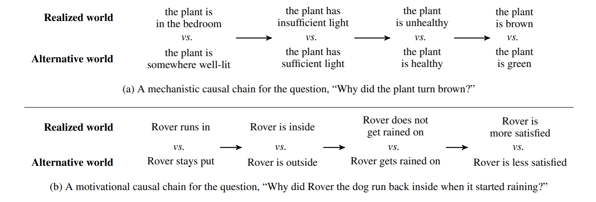
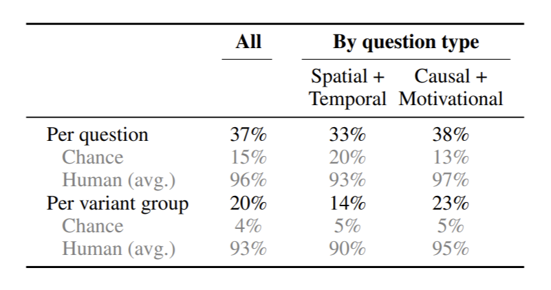

論文網址：\
[To Test Machine Comprehension, Start by Defining Comprehension](https://arxiv.org/abs/2005.01525)

### 概述

這篇論文是 2020 的 ACL 論文，主要在討論 Machine Reading Comprehension（MRC）的問題。這篇論文的觀點是認為，我們以為 model 有學到文章的內容並理解，但是實際上 model 只是把文章裡面的字詞和題目中的字詞作某種連結，沒有理解文章真正的內容。MCR 的應用非常廣泛，可以用於任何需要理解文章的事情（例如：從病人的病歷來取得資訊、關於文章的問答），不過一直都是一個 unsolved 的問題，因為 model 對於沒看過的資料表現很差（bad generalization）、會犯很奇怪的錯誤（在很簡單的問題上出錯）。

本篇論文質疑現有 MCR 的 model 是不是真的有理解文章的內容，因此就從最根本的問題開始定義：什麼是理解？Model 怎麼樣才算理解？

### 內容

這篇論文的大部份內容都還算直觀，因此就直接從本文開始分享。我把本文分成兩個部份，第一個部份是說明為何現有的 model 可能不是真的理解文章，第二個部份是作者提出的改善方案。

#### 為何現有的 Model 並不是真的理解文章

在概述有提到，MCR 的 model generalization 做的很不好，所以就有了「更難的問題」（新的或是擴充的 dataset）讓 model 來回答，期待 model 能夠透過回答「更難的問題」來更加理解文章的內容。但是作者就提出了質疑，真的能透過回答更難的問題來讓 model 對文章的理解提升嗎？作者就描述了以下這個情境：
> 一個職業的跑者到了健身房想要提升自己的表現，看到有人在做很困難的動作、用很酷炫的器材，於是就跟著訓練/使用。

雖然那個跑者可能還是有練到和跑步表現相關的肌肉，但是那樣的訓練過程看起來並不是在往目標（提升跑步上的表現）邁進。以上的這個例子就像是目前的 MCR 在做的事情，我們在訓練的 model 很可能不是在朝著最終的目標（理解文章）前進，而只是在作一些可能有相關，但又不太一樣的訓練。

再者，在現有 dataset 上面所做的 evaluation，真的有辦法代表 model 的理解力嗎？對於理解這件事情來說，最重要的是掌握文章的內容，如果那些用來 evaluation 所問的問題（例如：選擇題）所問的東西根本沒有切中文章的要害的話，那樣的 evaluation 似乎就沒有足夠的代表性。

作者將現有的 MCR dataset 的設計方法分為四種，並分別指出那樣的設計所會有的問題：
1. 人工產生的問題
2. 自然產生的問題
3. 為人類測驗設計的問題
4. 自動產生的問題
---

**人工產生的問題**

這類的 dataset 是最多的，這類的 dataset 就是請有受過訓練的（文中稱為 annotator），或是一般的普通人來想對於一篇文章的問題。通常這類方法並不太會限制問題的內容，最多就是限定選擇題的選項要有一個是與事實相反、一個與事實相符，和一個中性的敘述。這種產生方式的問題在於，因為沒有一個相對明確的問題產生準則，所以被產出的問題經常是一些由 lexical cue 就能回答出來的問題（只要知道字詞的意思就能回答），因此透過回答這樣的問題好像沒有辦法代表我們的 model 有學到如何理解文章。

對於以上的問題，現有的解法就是讓問題變得更難，例如：讓問題中的字詞變得和文章中的不同、讓問題需要從文章的多個地方取得線索才能被回答、讓回答問題需要多層的推理（multi-hop reasoning）等等的。這些改變確實能讓問題變得更難，但光是回答困難的問題，就可能忽略了一些看起來很簡單，但卻是理解文章基本的問題。並且難的問題也不一定是有用的，可能在實際的應用上根本不需要那麼難的問題。作者質疑難題和實用性的相關性並沒有很高。

並且，由人工產生的問題並不是完全隨機的，通常人工產生的問題會是人比較感興趣的部份，對於一些太簡單的問題（儘管可能是理解文章的基本問題），很可能就不會被工作人員覺得是好的問題。

這類 dataset 的問題統整如下：
* 問題可能只是由字詞的意思就能被回答（不必理解文章也能被回答）
* 產生更難的問題不一定能讓 model 學到更好的理解模式，回答難的問題和理解似乎不完全是同一件事情，而且那些難的問題也不一定和實際的應用場域是一致的
* 人工產生問題是有 bias 的，人工產生的問題可能只是 annotator 比較感興趣，或是答案不那麼直觀的問題

---
**自然產生的問題**

這種「自然產生的問題」指的是從現有的資料來收集的，例如從搜尋引擎的 query 裡面收集，或是從論壇的某些討論版收集（作者舉的例子是 reddit 的 explain like I'm five 討論版）。這類的 dataset 好處是容易有常見的問題，可以使得 model 比較可能學會回答常見的問題。但這類 dataset 的缺點是和 annotator 產生的問題相比，可能不夠詳盡，忽略掉人們覺得非常直觀，但卻對理解文章重要的問題。並且那些問的問題可能也不是針對回答裡面的大部份做的詢問，很可能只是對回答裡面的某部份做的詢問而已（想像一下在 stack exchange 找到的數學問題，雖然要回答提問可能需要整個解答的理解，但是反過來說，從解答的文章中要問問題的話，現有被詢問的問題很可能就不是針對文章的每個部份都有足夠的關聯性）。

這類 dataset 的問題統整如下：
* 和 annotator 產出的問題和答案相比，可能會忽略掉人們覺得非常直觀的部份
* 問題所問的內容可能只是對於文章的某一部份而已，對於文章其他部份的理解沒有足夠的代表性

---
**為人類測驗設計的問題**

這類的 dataset 就是從測驗人類的考題裡面蒐集的，例如某科目的考試。這類 dataset 的問題和「人工產生的問題」有類似的問題，就是人類的考試傾向不會考人們覺得直觀的問題，因此可能會忽略了理解文章所必須的基本重點，以至於 model 無法從這類的 dataset 裡面學到。並且因為人類測驗的問題很可能只針對文章的某些部份，所以讓 model 回答這類問題的表現很可能沒有對「理解文章」有足夠的代表性。

這類 dataset 的問題統整如下：
* 人類的考試不太會考太基本、簡單的問題（但那些簡單的問題可能是理解文章所必須的）
* 人類考試的問題可能只問了文章的某些部份（和自然產生方法有一樣的問題）

---
**自動產生的問題**

這類的 dataset 產生的方法是用演算法對現有的資料做處理，例如把新聞文章的某些字挖掉，或是從維基百科取出知識結構的 graph，再生成相關的問題。對「挖空格」方法來說，問題在於沒有一個明確的挖空格規則，導致我們並不知道 model 到底學到了什麼；對於「維基百科」的方法來說，問題是他們傾向於產生需要 multi-hop reasoning 的問題，儘管 multi-hop reasoning 的問題是 MRC model 的難題沒錯，但是作者質疑 inference step 和理解文章之間的關係並沒有很大。

這類 dataset 的問題統整如下：
* 沒有一個明確的規則
* multi-hop reasoning 的問題對於理解文章的必要性？

---

綜上所述，作者認為一個理想的 dataset 應該是從選定的文章之中，決定「什麼內容需要被理解」，再 based on 那些需要被理解的內容，設計出適當的 test，這樣的 evaluation 才是有意義的。

#### 作者提出的方法

作者提出了一個 Template of Understanding（ToU），是對於問題的設計的 template。在說明這個 template 之前，作者將之後的文章範圍限縮在故事，因為故事有以下幾個好處：
* 運用於故事的應用層面非常廣，所以訓練出來的 model 不會沒有用
* 人類經常會以故事的方式來思考以及溝通
* 理解一個故事所需要的元素幾乎是已知的（事件發生的先後順序、事件發生的地點等等的）
* cognitive science 有研究指出人類在閱讀故事（敘述文）的時候所做的 inference 比閱讀說明文還要多
* 故事的結構性很明確（人物、事件等等）
* 理解一個故事需要對現實世界的一定理解（如果是虛構的故事的話，就需要對文章內容有更強的理解）

**故事的 ToU**

一個故事的 ToU 可以分為以下幾點：
* 空間（spatial）：事件發生的空間關係，以及各個事件的空間關係
* 時間（temporal）：事件發生的時間，以及各個事件的時間關係
* 事件之間的影響關係（casual）：一件事情是如何影響另一件事的
* 角色的動機（motivational）：故事中的角色做某件事的動機

以上這四點是參考以前的一個 [work](https://www.jstor.org/stable/40063035?seq=1)，研究人類要理解一個故事所需的最小理解。作者也表示這四點並不是理解一個故事所需的所有重點，只是理解一個故事所需的**最小**理解而已。

對於文章的問題可以從 ToU 的四個面向來產生，但對於問題的答案呢，作者提出了兩種方向，第一種是直接由 annotator 所產生的答案來和 model 產生的答案做 evaluation，第二種是讓有訓練過的工作人員來判斷 model 怎樣的輸出比較好。

**基於 Annotator 的方法**

對於空間以及時間兩種問題來說，都有固定的答案，比較可能產生問題的是 casual 和 motivational 這兩種問題。作者認為要處理這種可能有很多答案的情況，
最好的解決辦法就是給 annotator 一個規範來作答，於是作者提出了 Casual Chain 的概念，將每一步驟的 inference 都清楚的寫出來，期待這樣可以讓 annotator 有一個比較能參考的準則。

作者在 12 個故事上面對 5 個 annotator 做了小小的實驗，實驗結果發現由 casual chain 的準則下產生的推理其實非常相近，不同 annotator 所做答的不同點通常都不是在內容，而是結構，而作者也期待在更多訓練之後的 annotator 能夠有更好的一致性。

接著就產生了下一個問題：要如何在那樣的文字敘述下 evaluate model 的表現呢？這個問題作者也還沒有好的答案，因為現有的 evaluation metric（例如：ROUGE、BLEU）都是針對字詞意義上的相似度，對於 model 回答和 annotator 的答案之間的關係是有的，但卻沒有一個保證。

因為沒有一個能夠自動計算而且夠好的 metric，所以可能就需要人類的 evaluation。雖然由人類來做最後的判讀成本非常的高，但作者提到說其實很多的 task 都是從人類手動 evaluate 開始，才有那些之後的 evaluation metric，所以也不必太過灰心。

如果要避免開放式問答的 evaluation 問題，就只能使用比較簡單的方式來測試 model 了，最常見的方法是用選擇題來 evaluate。雖然在 evaluation 比較方便，但以選擇題來作為表現的依據相較於直接回答一串文字來說，比較沒有說服力。在短期之間可能還可以使用選擇題的方式，但長期來說使用選擇題作為替代方案並不是一件好事。

---
**比較 model 的不同輸出**

另一種方法就是用比較的方式來 evaluate model 的表現。上一個區塊所想要達成的主要目標是讓 model 的輸出儘量的逼近 annotator 的答案，但這個方法想達成的目的是透過**比較**的方式來對 model 的不同輸出作評分。這種方法的假設是如果 model 的輸出能夠讓評分人員滿意的話，在現實的應用上也很可能有讓人滿意的表現。以下兩種方法是作者提出的可能性：
* 直接讓評分人員做 pairwise 的比較，判斷哪一個輸出是比較好的
* 將評分分為很多個部份，例如：精確度、深度等等的

第一種方法的好處是：對於開放式問題來說，人們會比較容易得到答案之間的相對關係（比較難以評分一個絕對的分數），並且人們經常會腦補沒看到的東西（例如 model 可能沒有輸出某件事情，但以為 model 的輸出有寫到），透過比較就更容易察覺不同輸出之間的差異。而第二種方法的好處是：相對於第一種方法，更有判斷的依據。

### 結果

作者拿了一個 state-of-the-art 的 model（[XLNet](https://arxiv.org/abs/1906.08237)）來做實驗，在以作者提出的原則所產生的 dataset 的表現：（最上面那一排是 XLNet 的表現，中間是亂猜的表現，最後一行是人類的平均表現）

在問題的設計上，這個實驗是採用選擇題的方式，故事的內容是取自 [RACE dataset](https://www.aclweb.org/anthology/D17-1082/)，作者還另外做了一個調整，將某些問題所問的東西分成兩個問題來問（換不同的問法來測試 model 是不是真的理解該問題的內容），第四到六個 row 就是要答對一個 pair 的問題才算答對的 performance。雖然人類回答的狀況也是有因為問題 pair 而降低，但是幅度不大，而 XLNet 卻降低了 15% 的表現。

本來 XLNet 在 RACE 上面的表現有 81.75%，但經過題目的修改之後，XLNet 的表現就只剩下 37%。這樣的結果似乎就證明了作者所提出的質疑是正確的，model 學到的東西似乎不是對於文章的理解。
